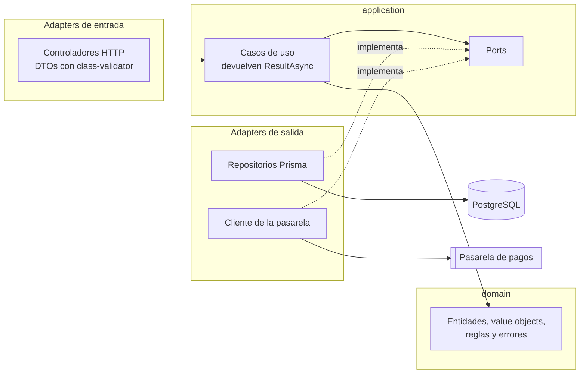
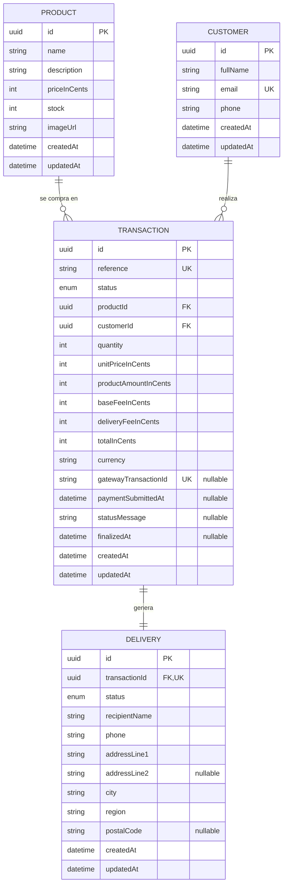
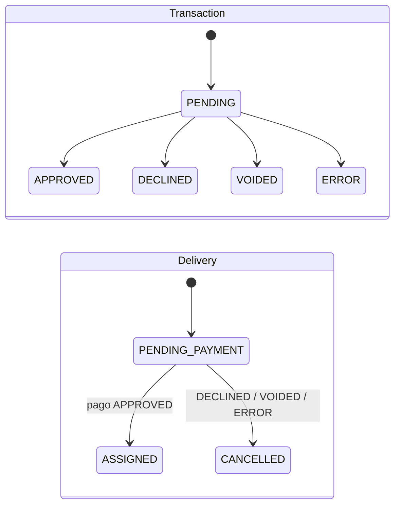
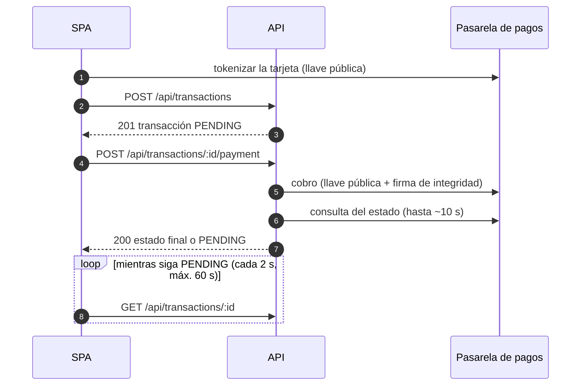

# Checkout App

Tienda **Templetus**: una SPA para comprar un producto y pagarlo con tarjeta de crédito a través de una pasarela de pagos externa, en su entorno Sandbox (sin dinero real).

El cliente elige un producto, llena la tarjeta y la dirección de entrega, revisa el resumen y paga. El backend crea la transacción en `PENDING`, reserva el inventario justo antes de cobrar, consulta el resultado en la pasarela y asigna o cancela la entrega. Una aprobación conserva la reserva; cualquier resultado final no aprobado devuelve las unidades. Si el cliente refresca la página en cualquier paso, la app retoma donde estaba sin volver a cobrar.

| | |
|---|---|
| **Aplicación** | _Se publica en el despliegue_ |
| **Swagger** | _Se publica en el despliegue_. En local: `http://localhost:3001/api/docs` |
| **Cobertura** | Backend **97,2 %** · Frontend **100 %** de líneas, solo con pruebas unitarias. [Ver reporte](#cobertura-de-pruebas) |

## Contenido

- [Flujo de la compra](#flujo-de-la-compra)
- [Stack](#stack)
- [Arquitectura](#arquitectura)
- [Modelo de datos](#modelo-de-datos)
- [API](#api)
- [Cobertura de pruebas](#cobertura-de-pruebas)
- [Seguridad](#seguridad)
- [Ejecución en local](#ejecución-en-local)
- [Despliegue](#despliegue)
- [Flujo de trabajo y uso de IA](#flujo-de-trabajo-y-uso-de-ia)

## Flujo de la compra

Las cinco pantallas del enunciado son los pasos de una máquina de estados guardada en Redux. La pantalla visible se deriva solo del paso actual, que se persiste en `localStorage`: por eso un refresh vuelve exactamente al mismo punto.

| Paso | Pantalla | Qué pasa |
|---|---|---|
| `PRODUCT` | 1. Producto | Catálogo con precio, descripción y unidades disponibles. Los agotados se muestran, pero no se pueden comprar |
| `PAYMENT_FORM` | 2. Tarjeta y entrega | Modal con tarjeta (Luhn, vencimiento, CVC y marca VISA o MasterCard detectada al escribir), contacto y dirección. Al continuar, la tarjeta se tokeniza en la pasarela desde el navegador |
| `SUMMARY` | 3. Resumen | Backdrop con el valor del producto, la tarifa base, el envío y el total. El cliente acepta los contratos de la pasarela y paga |
| `PROCESSING` | 4. Procesamiento | Se crea la transacción `PENDING`, se cobra y se consulta el estado hasta que la pasarela decide. Si la respuesta del cobro se pierde, conserva la compra y avisa que no se debe pagar otra vez |
| `RESULT` | 5. Resultado | Aprobado o rechazado, con el detalle. Al cerrar vuelve al catálogo con el inventario actualizado |

| Si refresca en… | La app… |
|---|---|
| Formulario | Recupera contacto y dirección. La tarjeta se escribe de nuevo: el número y el CVC nunca se guardan |
| Resumen | Vuelve al resumen con la tarjeta ya tokenizada y pide contratos nuevos (son de un solo uso) |
| Procesamiento | Retoma la consulta del estado con el id de la transacción. **Nunca vuelve a cobrar** |
| Resultado | Pide la transacción al backend por su id y muestra el resultado |

## Stack

| Capa | Tecnología |
|---|---|
| Frontend | React 19 + TypeScript, SPA empaquetada con Vite. Redux Toolkit + redux-persist, Tailwind CSS 4, lucide-react |
| Backend | NestJS 11 + TypeScript, Prisma 7, PostgreSQL 17, neverthrow (Railway Oriented Programming), Swagger |
| Pruebas | Jest 30 en ambos proyectos, React Testing Library y supertest |
| Calidad | ESLint con reglas que hacen cumplir la arquitectura, Prettier, TypeScript estricto |
| Infraestructura | Docker (PostgreSQL), Nginx, PM2 y HTTPS con Certbot |

Requisitos: Node 22 o superior, pnpm y Docker.

## Arquitectura

```text
frontend/   SPA en React (features + Redux)
backend/    API en NestJS (hexagonal + ROP)
deploy/     Configuración del servidor
```

### Backend: hexagonal (ports & adapters) + ROP

```text
backend/src/
├── shared/          Result (neverthrow) y AppError
├── domain/          Entidades, value objects, reglas y errores del negocio
├── application/     Ports (interfaces), DTOs y casos de uso
├── infrastructure/  Adapters: HTTP, Prisma, cliente de la pasarela y módulos de NestJS
└── config/          Validación de las variables de entorno
```



- **Regla de dependencias:** `infrastructure → application → domain → shared`. El dominio y los casos de uso no conocen NestJS, Prisma ni HTTP. ESLint lo hace cumplir: el lint falla si una capa interna importa un framework o una capa exterior.
- **Módulos del negocio:** inventario (`Product`), clientes (`Customer`), transacciones (`Transaction`) y entregas (`Delivery`, que vive dentro de la transacción porque se crean juntas).
- **Ids y hora por ports** (`IdGeneratorPort`, `ClockPort`): el dominio es determinista y se prueba sin simulaciones de tiempo.
- **Railway Oriented Programming:** los casos de uso encadenan pasos que devuelven `Result`; el primer error desvía el flujo al riel de error sin `try/catch` ni excepciones. Un pago rechazado es un resultado válido y viaja por el riel de éxito. Solo la capa HTTP convierte un error en un código HTTP.

Así se ve el caso de uso que cobra una transacción ([código completo](backend/src/application/use-cases/transaction/submit-payment.use-case.ts)):

```ts
execute(input: SubmitPaymentInput): ResultAsync<TransactionOutput, AppError> {
  return this.transactions
    .findViewById(input.transactionId)
    .andThen((view) => fromNullable(view, () => transactionNotFound(input.transactionId)))
    .andThen((view) => this.startPayment(view))    // sigue PENDING y no se envió antes
    .andThen((view) => this.claimSubmission(view)) // reclama el envío y reserva stock atómicamente
    .andThen((view) => this.charge(view, input).map((payment) => ({ view, payment })))
    .andThen(({ view, payment }) =>
      recordPaymentResult(this.transactions, view, payment, this.clock.now())
        .map((recorded) => ({ view: recorded, payment })), // guarda el id antes de esperar
    )
    .andThen(({ view, payment }) => this.waitForFinalResult(view, payment))
    .map(toTransactionOutput);
}
```

Referencia completa: [backend/docs/arquitectura/hexagonal-ddd-rop.md](backend/docs/arquitectura/hexagonal-ddd-rop.md).

### Frontend: SPA + Redux (Flux)

```text
frontend/src/
├── app/        Composición: elige la pantalla según el paso del checkout
├── features/   products, checkout y transaction (slice, thunks, selectores y componentes)
├── shared/     ui (componentes), lib (lógica pura), api (único lugar con fetch), hooks
└── store/      Store y persistencia
```

- **Flux unidireccional:** vista → `dispatch` → thunk → servicio de `shared/api` → reducer → selector → vista. Los componentes nunca llaman a la API.
- **Sin router:** la pantalla sale solo del paso guardado en el store, así una URL nunca contradice el estado persistido.
- **Solo se persiste el checkout:** paso, producto, borradores de contacto y dirección, el token y los últimos 4 dígitos de la tarjeta y el id de la transacción. Los productos se piden siempre para mostrar el stock real.
- **La tarjeta no pasa por Redux:** se tokeniza con un hook y no con un thunk, porque `createAsyncThunk` guarda su argumento en la acción y el número quedaría en Redux DevTools.
- **Mobile first** desde 375 px (iPhone SE 2020), con flexbox y grid y sin desbordamientos. Imágenes WebP en dos anchos con `srcSet`, dimensiones reservadas y carga diferida.
- **Identidad visual Templetus:** paleta azul, tipografía Inter, esquinas rectas y tema oscuro automático, todo desde tokens de Tailwind.

Referencia completa: [frontend/docs/arquitectura/spa-redux-flux.md](frontend/docs/arquitectura/spa-redux-flux.md).

## Modelo de datos





- **Dinero en centavos y enteros** (`*InCents`), nunca decimales, igual que la pasarela.
- **La transacción copia precio y tarifas** del momento de la compra: si el producto cambia de precio, el histórico no se altera. Las tarifas las calcula siempre el backend.
- **Reserva de inventario antes del cobro:** la reclamación de `paymentSubmittedAt` y el decremento condicional (`WHERE stock >= quantity`) ocurren en una sola transacción PostgreSQL. Dos compradores no pueden pagar la misma última unidad.
- **Liquidación idempotente:** `APPROVED` conserva la reserva y asigna la entrega. `DECLINED`, `VOIDED` o `ERROR` cancelan la entrega y devuelven las unidades exactamente una vez.
- **Nunca se cobra dos veces:** `paymentSubmittedAt` se reclama con un `UPDATE … WHERE payment_submitted_at IS NULL`; de dos peticiones simultáneas sobre la misma compra solo una llega a la pasarela.
- **Resultado ambiguo seguro:** un rechazo HTTP confirmado termina en `ERROR`; una caída de red, timeout o 5xx mantiene la compra `PENDING` y el stock reservado. El identificador externo se guarda antes del polling, por lo que una consulta posterior puede conciliar el resultado sin reenviar el cobro.
- **Los datos de la tarjeta no se guardan** en ninguna tabla: ni número, ni CVC, ni token.
- Identificadores **UUID v7** y nombres en inglés: tablas en `snake_case` plural (`products`, `transactions`…) mapeadas desde Prisma. Las migraciones se generan con Prisma y los productos iniciales se cargan con un seed idempotente.

| Producto (seed) | Precio (COP) | Stock |
|---|---|---|
| Audífonos inalámbricos | 189.900 | 12 |
| Reloj inteligente | 349.900 | 8 |
| Teclado mecánico | 259.900 | 5 |
| Mouse ergonómico | 89.900 | 20 |
| Parlante Bluetooth portátil | 149.900 | 1 (para ver cómo se agota tras una compra) |
| Cámara web 4K | 219.900 | 0 (para ver un producto agotado) |

Tablas, reglas de cada campo y decisiones: [backend/docs/api/contrato-api.md](backend/docs/api/contrato-api.md#2-modelo-de-datos).

## API

Documentación interactiva con **Swagger** en `/api/docs`; la especificación OpenAPI está en `/api/docs-json` y se puede importar en Postman.

| Método | Ruta | Módulo | Para qué |
|---|---|---|---|
| `GET` | `/api/products` | Inventario | Productos con su stock |
| `GET` | `/api/products/:id` | Inventario | Detalle de un producto |
| `GET` | `/api/checkout/config` | Checkout | Tarifas, URL y llave pública de la pasarela y contratos a aceptar |
| `POST` | `/api/transactions` | Transacciones, clientes y entregas | Crea la transacción `PENDING` con su cliente y su entrega |
| `POST` | `/api/transactions/:id/payment` | Transacciones | Cobra en la pasarela con la tarjeta tokenizada |
| `GET` | `/api/transactions/:id` | Transacciones | Consulta el estado y liquida la transacción si ya es final |
| `GET` | `/api/health` | — | Comprueba que la API está en marcha |

Clientes y entregas son módulos completos del backend, pero no tienen endpoints propios: se crean y se leen a través de las transacciones. Exponerlos sin autenticación filtraría datos personales.

Los errores tienen una sola forma, con un código estable que el frontend traduce a un mensaje:

```json
{ "code": "OUT_OF_STOCK", "message": "Not enough units available" }
```



Request, response y errores de cada endpoint: [backend/docs/api/contrato-api.md](backend/docs/api/contrato-api.md#5-endpoints).

## Cobertura de pruebas

Medida **solo con las pruebas unitarias** (`pnpm test:cov`). Ambos proyectos fallan si la cobertura baja del 80 %.

**Backend:** 369 pruebas unitarias en 52 suites.

| Capa | Statements | Branches | Functions | Lines |
|---|---|---|---|---|
| `domain` | 100 % | 100 % | 100 % | 100 % |
| `application` | 100 % | 100 % | 100 % | 100 % |
| `shared` | 100 % | 100 % | 100 % | 100 % |
| `config` | 100 % | 75 % | 100 % | 100 % |
| `infrastructure/http` | 92,15 % | 84,69 % | 94,11 % | 92,19 % |
| `infrastructure/payment-gateway` | 100 % | 98,07 % | 100 % | 100 % |
| `infrastructure/persistence` | 100 % | 86,66 % | 100 % | 100 % |
| Resto de `infrastructure` | 100 % | 80 % | 100 % | 100 % |
| **Total** | **97,28 %** | **90,37 %** | **99,06 %** | **97,20 %** |

**Frontend:** 424 pruebas unitarias en 70 suites.

| Carpeta | Statements | Branches | Functions | Lines |
|---|---|---|---|---|
| `features/checkout` | 100 % | 98,95 % | 100 % | 100 % |
| `features/products` | 100 % | 100 % | 100 % | 100 % |
| `features/transaction` | 100 % | 100 % | 100 % | 100 % |
| `shared` (ui, lib, api, hooks) | 100 % | 100 % | 100 % | 100 % |
| `store` y `app` | 100 % | 100 % | 100 % | 100 % |
| **Total** | **100 %** | **99,50 %** | **100 %** | **100 %** |

Además de las unitarias:

| Nivel | Backend | Frontend |
|---|---|---|
| Integración | 47 pruebas: controladores con supertest y el cableado de cada módulo de NestJS, con la base de datos y la pasarela simuladas | 6 pruebas: el checkout completo con el store y la persistencia reales, también tras un refresh; solo la red se simula |
| End-to-end | 20 pruebas contra PostgreSQL y el Sandbox reales: incluyen la reserva concurrente; las de pago cobran de verdad, y al terminar restauran el stock y borran sus datos | — |

Las pruebas viven en `tests/`, fuera de `src/`, con una carpeta por nivel. Las unitarias replican la ruta del archivo que prueban.

## Seguridad

- **La tarjeta nunca llega al backend.** El navegador la tokeniza directamente en la pasarela con la llave pública; al backend y a `localStorage` solo llegan el token, la marca y los últimos 4 dígitos.
- **El secreto de integridad vive solo en el backend** y firma cada cobro (SHA-256). El backend no usa la llave privada: la pasarela cobra con la llave pública y la firma, así que es un secreto menos que proteger.
- **Credenciales fuera del repositorio:** solo existe `.env.example`, con los valores de la pasarela vacíos. La API valida sus variables al arrancar y no inicia si falta alguna.
- **Validación estricta de entrada:** DTOs con class-validator; un campo desconocido responde 400 (por ejemplo, si alguien envía `cardNumber` al backend).
- **Cabeceras de seguridad con helmet, CORS restringido al origen del frontend y rate limiting:** 100 peticiones por minuto por IP y 10 intentos de pago por minuto.
- **Pagos e inventario idempotentes:** el envío y el stock se reservan atómicamente, la referencia es única por transacción y el cobro nunca se reintenta automáticamente. Un resultado ambiguo conserva `PENDING` y la reserva; solo las consultas a la pasarela se reintentan ante fallos pasajeros.
- **Sin `dangerouslySetInnerHTML`** en el frontend, y ESLint impide que el número de tarjeta o el CVC entren al store.
- PostgreSQL solo escucha en `127.0.0.1`. En producción, Nginx sirve HTTPS y añade las cabeceras de seguridad de la SPA.

## Ejecución en local

**1. Base de datos** (desde la raíz):

```bash
docker compose up -d   # PostgreSQL 17 en localhost:5433
```

**2. Backend** (desde `backend/`):

```bash
cp .env.example .env   # completa las tres variables de la pasarela
pnpm install           # instala y genera el cliente de Prisma
pnpm db:deploy         # aplica las migraciones
pnpm db:seed           # carga los productos
pnpm start:dev         # http://localhost:3001/api · Swagger en /api/docs
```

La URL de Sandbox, la llave pública y el secreto de integridad están en el enunciado de la prueba y van en `PAYMENT_GATEWAY_BASE_URL`, `PAYMENT_GATEWAY_PUBLIC_KEY` y `PAYMENT_GATEWAY_INTEGRITY_SECRET`. En el PDF la `l` minúscula y la `I` mayúscula se confunden: si la pasarela responde 404 o "La firma es inválida", revisa esas letras. El resto de variables tiene valores por defecto ([lista completa](backend/docs/api/contrato-api.md#8-variables-de-entorno)).

**3. Frontend** (desde `frontend/`):

```bash
pnpm install
pnpm dev               # http://localhost:3000
```

La SPA no necesita variables de entorno: llama a `/api` en su mismo origen (Vite la reenvía al backend) y recibe la configuración de la pasarela del backend.

**Tarjetas de prueba del Sandbox** (con cualquier fecha futura y cualquier CVC de 3 dígitos):

| Número | Resultado |
|---|---|
| `4242 4242 4242 4242` | Aprobada |
| `4111 1111 1111 1111` | Rechazada |

**Comandos de calidad** (en `backend/` y en `frontend/`):

| Comando | Qué hace |
|---|---|
| `pnpm test:cov` | Pruebas unitarias con cobertura |
| `pnpm test:integration` | Pruebas de integración |
| `pnpm test:e2e` | Solo backend: pruebas end-to-end contra PostgreSQL y el Sandbox |
| `pnpm lint` | ESLint, incluidas las reglas de arquitectura |
| `pnpm typecheck` | Comprobación de tipos |

## Despliegue

_Esta sección se completa con el despliegue._ La arquitectura prevista es un servidor con Nginx, que sirve la SPA y reenvía `/api` a la API de NestJS gestionada con PM2, PostgreSQL en Docker y HTTPS con Certbot.

## Flujo de trabajo y uso de IA

- **Git:** cada funcionalidad se desarrolla en su rama (`feature/`, `fix/`, `docs/`…) desde `staging` y vuelve por Pull Request con merge commit, para conservar el historial. `main` solo recibe la entrega final. Los commits siguen Conventional Commits, en español, y cada uno compila y pasa sus pruebas.
- **IA como asistente:** el proyecto se desarrolló con Claude Code. [`CLAUDE.md`](CLAUDE.md) recoge las reglas del proyecto (arquitectura, seguridad, base de datos, pruebas y Git), y las skills de [`.claude/skills/`](.claude/skills/) guían, paso a paso, cómo crear una funcionalidad en el backend y en el frontend. Las reglas que no pueden quedar a criterio de nadie, ni de una persona ni de la IA, las hace cumplir ESLint: capas, `fetch` y `localStorage` en un solo lugar, datos de tarjeta fuera del store, y nada de hora ni azar implícitos en el dominio.
