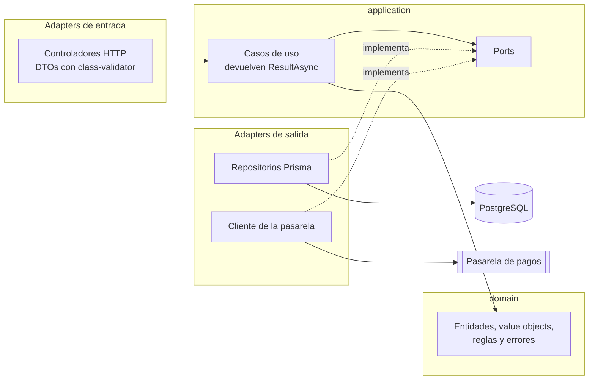
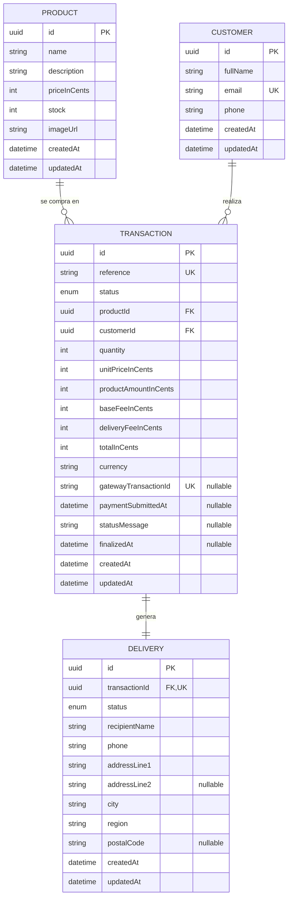
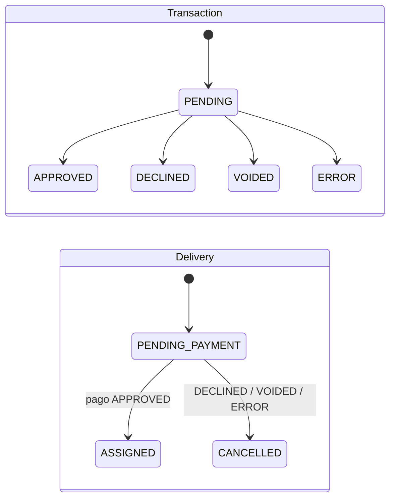
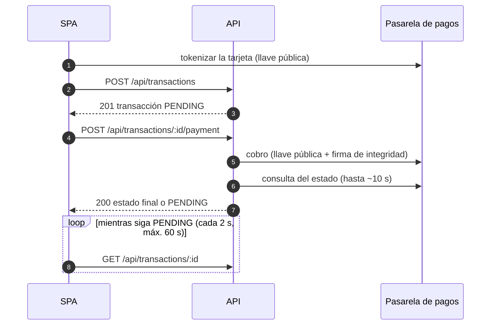

# Checkout App

Tienda **Templetus**: una SPA para comprar un producto y pagarlo con tarjeta de crédito a través de una pasarela de pagos externa, en su entorno Sandbox (sin dinero real).

El cliente elige un producto, llena la tarjeta y la dirección de entrega, revisa el resumen y paga. El backend crea la transacción en `PENDING`, cobra en la pasarela, asigna la entrega y descuenta el inventario solo si el pago se aprueba. Si el cliente refresca la página en cualquier paso, la app retoma donde estaba sin volver a cobrar.

| | |
|---|---|
| **Aplicación** | _Se publica en el despliegue_ |
| **Swagger** | _Se publica en el despliegue_. En local: `http://localhost:3001/api/docs` |

## Contenido

- [Flujo de la compra](#flujo-de-la-compra)
- [Stack](#stack)
- [Arquitectura](#arquitectura)
- [Modelo de datos](#modelo-de-datos)
- [API](#api)

## Flujo de la compra

Las cinco pantallas del enunciado son los pasos de una máquina de estados guardada en Redux. La pantalla visible se deriva solo del paso actual, que se persiste en `localStorage`: por eso un refresh vuelve exactamente al mismo punto.

| Paso | Pantalla | Qué pasa |
|---|---|---|
| `PRODUCT` | 1. Producto | Catálogo con precio, descripción y unidades disponibles. Los agotados se muestran, pero no se pueden comprar |
| `PAYMENT_FORM` | 2. Tarjeta y entrega | Modal con tarjeta (Luhn, vencimiento, CVC y marca VISA o MasterCard detectada al escribir), contacto y dirección. Al continuar, la tarjeta se tokeniza en la pasarela desde el navegador |
| `SUMMARY` | 3. Resumen | Backdrop con el valor del producto, la tarifa base, el envío y el total. El cliente acepta los contratos de la pasarela y paga |
| `PROCESSING` | 4. Procesamiento | Se crea la transacción `PENDING`, se cobra y se consulta el estado hasta que la pasarela decide |
| `RESULT` | 5. Resultado | Aprobado o rechazado, con el detalle. Al cerrar vuelve al catálogo con el inventario actualizado |

| Si refresca en… | La app… |
|---|---|
| Formulario | Recupera contacto y dirección. La tarjeta se escribe de nuevo: el número y el CVC nunca se guardan |
| Resumen | Vuelve al resumen con la tarjeta ya tokenizada y pide contratos nuevos (son de un solo uso) |
| Procesamiento | Retoma la consulta del estado con el id de la transacción. **Nunca vuelve a cobrar** |
| Resultado | Pide la transacción al backend por su id y muestra el resultado |

## Stack

| Capa | Tecnología |
|---|---|
| Frontend | React 19 + TypeScript, SPA empaquetada con Vite. Redux Toolkit + redux-persist, Tailwind CSS 4, lucide-react |
| Backend | NestJS 11 + TypeScript, Prisma 7, PostgreSQL 17, neverthrow (Railway Oriented Programming), Swagger |
| Pruebas | Jest 30 en ambos proyectos, React Testing Library y supertest |
| Calidad | ESLint con reglas que hacen cumplir la arquitectura, Prettier, TypeScript estricto |
| Infraestructura | Docker (PostgreSQL), Nginx, PM2 y HTTPS con Certbot |

Requisitos: Node 22 o superior, pnpm y Docker.

## Arquitectura

```text
frontend/   SPA en React (features + Redux)
backend/    API en NestJS (hexagonal + ROP)
deploy/     Configuración del servidor
```

### Backend: hexagonal (ports & adapters) + ROP

```text
backend/src/
├── shared/          Result (neverthrow) y AppError
├── domain/          Entidades, value objects, reglas y errores del negocio
├── application/     Ports (interfaces), DTOs y casos de uso
├── infrastructure/  Adapters: HTTP, Prisma, cliente de la pasarela y módulos de NestJS
└── config/          Validación de las variables de entorno
```



- **Regla de dependencias:** `infrastructure → application → domain → shared`. El dominio y los casos de uso no conocen NestJS, Prisma ni HTTP. ESLint lo hace cumplir: el lint falla si una capa interna importa un framework o una capa exterior.
- **Módulos del negocio:** inventario (`Product`), clientes (`Customer`), transacciones (`Transaction`) y entregas (`Delivery`, que vive dentro de la transacción porque se crean juntas).
- **Ids y hora por ports** (`IdGeneratorPort`, `ClockPort`): el dominio es determinista y se prueba sin simulaciones de tiempo.
- **Railway Oriented Programming:** los casos de uso encadenan pasos que devuelven `Result`; el primer error desvía el flujo al riel de error sin `try/catch` ni excepciones. Un pago rechazado es un resultado válido y viaja por el riel de éxito. Solo la capa HTTP convierte un error en un código HTTP.

Así se ve el caso de uso que cobra una transacción ([código completo](backend/src/application/use-cases/transaction/submit-payment.use-case.ts)):

```ts
execute(input: SubmitPaymentInput): ResultAsync<TransactionOutput, AppError> {
  return this.transactions
    .findViewById(input.transactionId)
    .andThen((view) => fromNullable(view, () => transactionNotFound(input.transactionId)))
    .andThen((view) => this.startPayment(view))    // sigue PENDING y queda stock
    .andThen((view) => this.claimSubmission(view)) // reserva atómica: nunca se cobra dos veces
    .andThen((view) => this.charge(view, input).map((payment) => ({ view, payment })))
    .andThen(({ view, payment }) =>
      recordPaymentResult(this.transactions, view, payment, this.clock.now()),
    )
    .map(toTransactionOutput);
}
```

Referencia completa: [backend/docs/arquitectura/hexagonal-ddd-rop.md](backend/docs/arquitectura/hexagonal-ddd-rop.md).

### Frontend: SPA + Redux (Flux)

```text
frontend/src/
├── app/        Composición: elige la pantalla según el paso del checkout
├── features/   products, checkout y transaction (slice, thunks, selectores y componentes)
├── shared/     ui (componentes), lib (lógica pura), api (único lugar con fetch), hooks
└── store/      Store y persistencia
```

- **Flux unidireccional:** vista → `dispatch` → thunk → servicio de `shared/api` → reducer → selector → vista. Los componentes nunca llaman a la API.
- **Sin router:** la pantalla sale solo del paso guardado en el store, así una URL nunca contradice el estado persistido.
- **Solo se persiste el checkout:** paso, producto, borradores de contacto y dirección, el token y los últimos 4 dígitos de la tarjeta y el id de la transacción. Los productos se piden siempre para mostrar el stock real.
- **La tarjeta no pasa por Redux:** se tokeniza con un hook y no con un thunk, porque `createAsyncThunk` guarda su argumento en la acción y el número quedaría en Redux DevTools.
- **Mobile first** desde 375 px (iPhone SE 2020), con flexbox y grid y sin desbordamientos. Imágenes WebP en dos anchos con `srcSet`, dimensiones reservadas y carga diferida.
- **Identidad visual Templetus:** paleta azul, tipografía Inter, esquinas rectas y tema oscuro automático, todo desde tokens de Tailwind.

Referencia completa: [frontend/docs/arquitectura/spa-redux-flux.md](frontend/docs/arquitectura/spa-redux-flux.md).

## Modelo de datos





- **Dinero en centavos y enteros** (`*InCents`), nunca decimales, igual que la pasarela.
- **La transacción copia precio y tarifas** del momento de la compra: si el producto cambia de precio, el histórico no se altera. Las tarifas las calcula siempre el backend.
- **Liquidación en una sola transacción de base de datos:** al aprobarse, la transacción pasa a `APPROVED`, el stock baja (`WHERE stock >= quantity`) y la entrega queda `ASSIGNED`. Si no se aprueba, la entrega se cancela y el stock no cambia.
- **Nunca se cobra dos veces:** `paymentSubmittedAt` se reserva con un `UPDATE … WHERE payment_submitted_at IS NULL`; de dos peticiones simultáneas solo una llega a la pasarela.
- **Los datos de la tarjeta no se guardan** en ninguna tabla: ni número, ni CVC, ni token.
- Identificadores **UUID v7** y nombres en inglés: tablas en `snake_case` plural (`products`, `transactions`…) mapeadas desde Prisma. Las migraciones se generan con Prisma y los productos iniciales se cargan con un seed idempotente.

| Producto (seed) | Precio (COP) | Stock |
|---|---|---|
| Audífonos inalámbricos | 189.900 | 12 |
| Reloj inteligente | 349.900 | 8 |
| Teclado mecánico | 259.900 | 5 |
| Mouse ergonómico | 89.900 | 20 |
| Parlante Bluetooth portátil | 149.900 | 1 (para ver cómo se agota tras una compra) |
| Cámara web 4K | 219.900 | 0 (para ver un producto agotado) |

Tablas, reglas de cada campo y decisiones: [backend/docs/api/contrato-api.md](backend/docs/api/contrato-api.md#2-modelo-de-datos).

## API

Documentación interactiva con **Swagger** en `/api/docs`; la especificación OpenAPI está en `/api/docs-json` y se puede importar en Postman.

| Método | Ruta | Módulo | Para qué |
|---|---|---|---|
| `GET` | `/api/products` | Inventario | Productos con su stock |
| `GET` | `/api/products/:id` | Inventario | Detalle de un producto |
| `GET` | `/api/checkout/config` | Checkout | Tarifas, URL y llave pública de la pasarela y contratos a aceptar |
| `POST` | `/api/transactions` | Transacciones, clientes y entregas | Crea la transacción `PENDING` con su cliente y su entrega |
| `POST` | `/api/transactions/:id/payment` | Transacciones | Cobra en la pasarela con la tarjeta tokenizada |
| `GET` | `/api/transactions/:id` | Transacciones | Consulta el estado y liquida la transacción si ya es final |
| `GET` | `/api/health` | — | Comprueba que la API está en marcha |

Clientes y entregas son módulos completos del backend, pero no tienen endpoints propios: se crean y se leen a través de las transacciones. Exponerlos sin autenticación filtraría datos personales.

Los errores tienen una sola forma, con un código estable que el frontend traduce a un mensaje:

```json
{ "code": "OUT_OF_STOCK", "message": "Not enough units available" }
```



Request, response y errores de cada endpoint: [backend/docs/api/contrato-api.md](backend/docs/api/contrato-api.md#5-endpoints).
