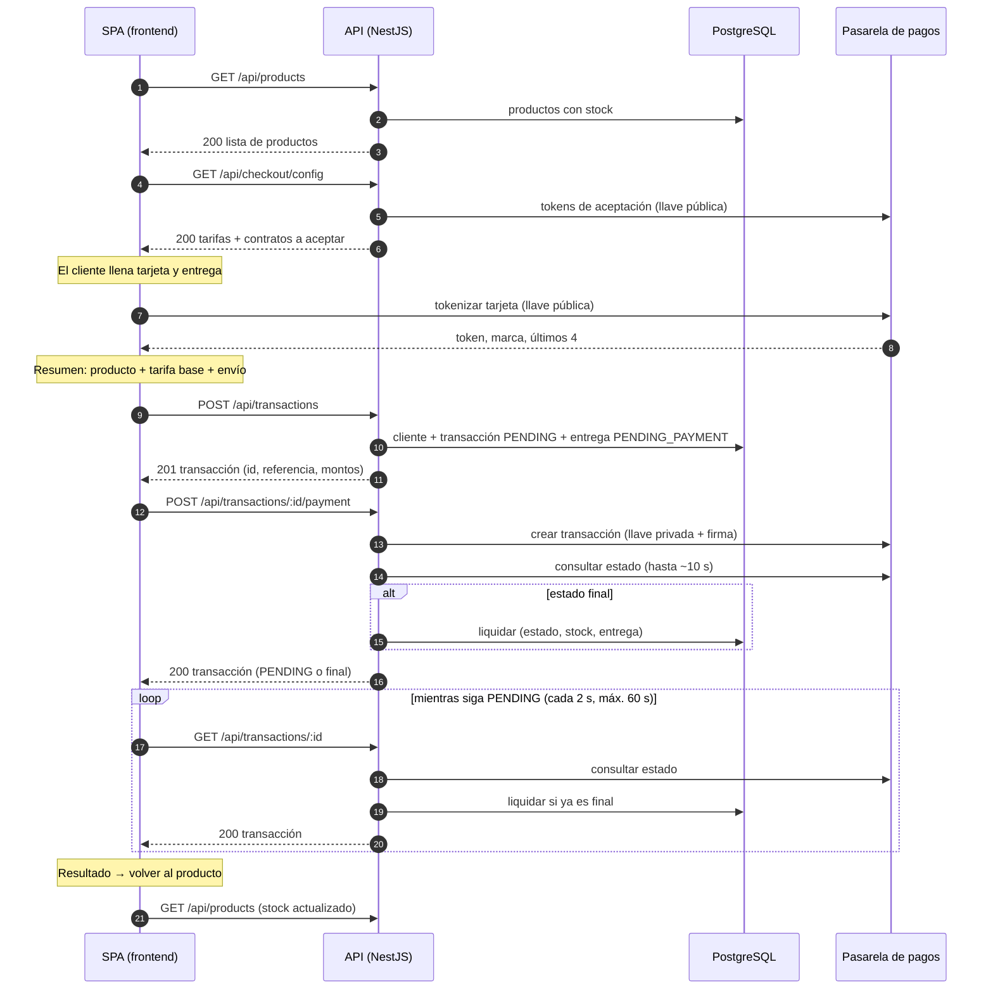
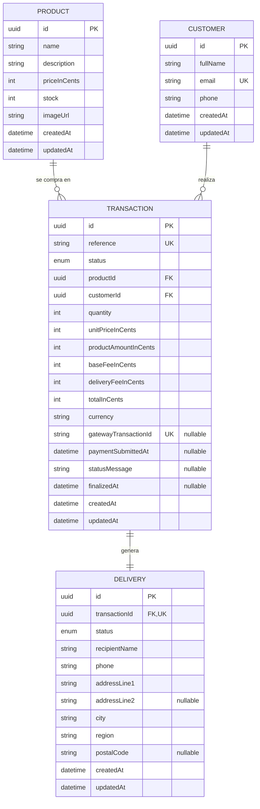
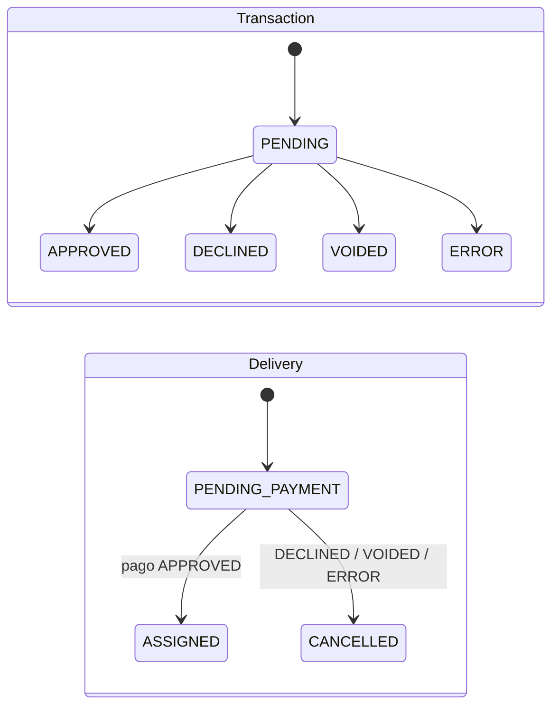

# Modelo de datos y contrato de la API

Diseño acordado antes de programar: qué se guarda en la base de datos, qué endpoints expone el backend, qué devuelve cada uno y con qué errores. El frontend y el backend se construyen contra este contrato.

## 1. Flujo de extremo a extremo



### Por qué la transacción se crea y se paga en dos llamadas

- Sigue literalmente el enunciado: primero se crea la transacción `PENDING` y se obtiene su número; después se llama a la pasarela.
- El `id` de la transacción se persiste en el frontend. Si el cliente refresca a mitad del pago, la SPA retoma con ese `id` en vez de crear otra transacción.
- El pago se puede reintentar de forma segura: el backend rechaza un segundo envío a la pasarela para la misma transacción (`PAYMENT_ALREADY_SUBMITTED`), así que nunca hay doble cobro.

## 2. Modelo de datos



### Tablas

**`Product`** (inventario)

| Campo | Tipo | Reglas |
|-------|------|--------|
| `id` | UUID | PK |
| `name` | texto (120) | Obligatorio |
| `description` | texto | Obligatorio |
| `priceInCents` | entero | `> 0`. Precio unitario en centavos |
| `stock` | entero | `>= 0`. Unidades disponibles |
| `imageUrl` | texto | Ruta de la imagen (servida por el frontend) |

**`Customer`**

| Campo | Tipo | Reglas |
|-------|------|--------|
| `id` | UUID | PK |
| `fullName` | texto (120) | Obligatorio |
| `email` | texto | Único. Si el correo ya existe, se reutiliza el cliente y se actualizan nombre y teléfono |
| `phone` | texto (20) | Obligatorio |

**`Transaction`**

| Campo | Tipo | Reglas |
|-------|------|--------|
| `id` | UUID | PK. Es el "número de transacción" que ve el cliente |
| `reference` | texto | Único. Generado por el backend; se envía a la pasarela y entra en la firma |
| `status` | enum | `PENDING`, `APPROVED`, `DECLINED`, `VOIDED`, `ERROR` |
| `quantity` | entero | `1..10` |
| `unitPriceInCents` | entero | Precio del producto **copiado** al crear la transacción |
| `productAmountInCents` | entero | `unitPriceInCents × quantity` |
| `baseFeeInCents` | entero | Tarifa base, siempre se cobra |
| `deliveryFeeInCents` | entero | Tarifa de envío |
| `totalInCents` | entero | Suma de los tres montos. Es lo que se cobra |
| `currency` | texto (3) | `COP` |
| `gatewayTransactionId` | texto | Único, nulo hasta enviar el pago |
| `paymentSubmittedAt` | fecha | Nulo hasta enviar el pago. Evita el doble cobro |
| `statusMessage` | texto | Motivo devuelto por la pasarela (rechazo o error) |
| `finalizedAt` | fecha | Momento en que llegó a un estado final |

**`Delivery`**

| Campo | Tipo | Reglas |
|-------|------|--------|
| `id` | UUID | PK |
| `transactionId` | UUID | FK única: una entrega por transacción |
| `status` | enum | `PENDING_PAYMENT`, `ASSIGNED`, `CANCELLED` |
| `recipientName`, `phone` | texto | Quién recibe |
| `addressLine1`, `addressLine2` | texto | Dirección; la segunda línea es opcional |
| `city`, `region` | texto | Ciudad y departamento |
| `postalCode` | texto | Opcional |

### Decisiones del modelo

- **Dinero en centavos y enteros**, nunca decimales, igual que la pasarela (`amount_in_cents`). Con `Int` de PostgreSQL el máximo por monto es ~21 millones de COP, suficiente para esta tienda.
- **La transacción copia los precios y tarifas** del momento de la compra: si el producto cambia de precio después, el histórico no se altera.
- **Las tarifas las calcula siempre el backend.** El frontend las muestra en el resumen, pero en `POST /api/transactions` no las envía: el backend las recalcula.
- **La entrega se crea junto con la transacción** en `PENDING_PAYMENT`, porque los datos de envío se capturan antes de pagar. Al aprobarse el pago pasa a `ASSIGNED` (el producto queda asignado al cliente); si no se aprueba, a `CANCELLED`.
- **Los datos de la tarjeta no se guardan** en ninguna tabla: ni número, ni CVC, ni el token.

- **Las reglas numéricas** (`priceInCents > 0`, `stock >= 0`, `quantity 1..10`) las hace cumplir el dominio y la actualización condicional del stock. El esquema de Prisma no soporta restricciones `CHECK`, y añadirlas exigiría editar una migración a mano, algo que no se hace en este proyecto.

### Nombres en la base de datos

Todo en inglés. En Prisma, modelos en `PascalCase` singular y campos en `camelCase`; en PostgreSQL, tablas en `snake_case` plural y columnas en `snake_case`:

| Modelo (Prisma) | Tabla (PostgreSQL) | Ejemplo de campo → columna |
|-----------------|--------------------|----------------------------|
| `Product` | `products` | `priceInCents` → `price_in_cents` |
| `Customer` | `customers` | `fullName` → `full_name` |
| `Transaction` | `transactions` | `gatewayTransactionId` → `gateway_transaction_id` |
| `Delivery` | `deliveries` | `addressLine1` → `address_line1` |
| `TransactionStatus` (enum) | `transaction_status` | `PENDING`, `APPROVED`… |
| `DeliveryStatus` (enum) | `delivery_status` | `PENDING_PAYMENT`, `ASSIGNED`… |

- Índices y claves foráneas con los nombres que genera Prisma: `transactions_product_id_idx`, `transactions_product_id_fkey`…
- Identificadores **UUID v7** (ordenados por tiempo, mejores para los índices) y fechas `TIMESTAMPTZ(3)`.
- El esquema está en `backend/prisma/schema.prisma`. **Las migraciones se generan siempre con `pnpm db:migrate --name <cambio>`**; nunca se escriben ni editan a mano.

### Datos iniciales (seed)

`backend/prisma/seed.ts`, ejecutado con `pnpm db:seed`. No hay endpoints para crear productos.

| ID | Producto | Precio (COP) | Stock |
|----|----------|--------------|-------|
| `01920000-0000-7000-8000-000000000001` | Audífonos inalámbricos | 189.900 | 12 |
| `01920000-0000-7000-8000-000000000002` | Reloj inteligente | 349.900 | 8 |
| `01920000-0000-7000-8000-000000000003` | Teclado mecánico | 259.900 | 5 |
| `01920000-0000-7000-8000-000000000004` | Mouse ergonómico | 89.900 | 20 |
| `01920000-0000-7000-8000-000000000005` | Parlante Bluetooth portátil | 149.900 | **1** (para probar el agotamiento tras una compra) |
| `01920000-0000-7000-8000-000000000006` | Cámara web 4K | 219.900 | **0** (para probar el estado agotado) |

- Es **idempotente**: crea los productos que faltan y no modifica los existentes, así que nunca pisa el stock de una base de datos en uso.
- Para volver al estado inicial en desarrollo: `pnpm db:reset` (borra la base, aplica las migraciones y vuelve a ejecutar el seed).

## 3. Estados



- Una transacción **solo sale de `PENDING` una vez**. Intentar resolverla de nuevo devuelve `TRANSACTION_ALREADY_RESOLVED`.
- **Liquidación** (se ejecuta una sola vez, al llegar a un estado final), en una única transacción de base de datos:
  - `APPROVED`: transacción `APPROVED` + `stock = stock − quantity` + entrega `ASSIGNED`.
  - `DECLINED` / `VOIDED` / `ERROR`: transacción con ese estado + entrega `CANCELLED`. El stock no cambia.
- **El stock solo se descuenta si el pago se aprueba.** Se comprueba al crear la transacción y otra vez justo antes de enviar el pago; el descuento final es condicional (`WHERE stock >= quantity`).
- **Riesgo aceptado:** si dos clientes pagan la última unidad casi a la vez, el segundo podría quedar aprobado sin stock. La doble comprobación deja esa ventana en milisegundos; en un sistema real se resolvería reservando stock o anulando el pago.

## 4. Convenciones de la API

- Prefijo **`/api`**. JSON con claves en `camelCase`.
- Montos siempre en **centavos, como enteros**, acompañados de `currency`.
- Fechas en **ISO 8601 UTC**. Identificadores **UUID**.
- Documentación interactiva con Swagger en **`/api/docs`**.
- **Errores** con una forma única:

  ```json
  { "code": "OUT_OF_STOCK", "message": "Not enough units available" }
  ```

  Los errores de formato de la petición (400) añaden `details` con los campos inválidos:

  ```json
  {
    "code": "INVALID_REQUEST",
    "message": "Request validation failed",
    "details": [{ "field": "customer.email", "message": "email must be an email" }]
  }
  ```

- **Rate limiting:** límite general por IP y uno más estricto en `POST /api/transactions/:id/payment`.

## 5. Endpoints

| Método | Ruta | Módulo | Para qué |
|--------|------|--------|----------|
| `GET` | `/api/products` | Inventario | Listar productos con su stock |
| `GET` | `/api/products/:id` | Inventario | Detalle de un producto |
| `GET` | `/api/checkout/config` | Checkout | Tarifas y contratos que el cliente debe aceptar |
| `POST` | `/api/transactions` | Transacciones, clientes, entregas | Crear la transacción `PENDING` |
| `POST` | `/api/transactions/:id/payment` | Transacciones | Enviar el pago a la pasarela |
| `GET` | `/api/transactions/:id` | Transacciones | Consultar (y sincronizar) el estado |

**Clientes y entregas no tienen endpoints propios.** Son módulos completos del backend (dominio, casos de uso y repositorios), pero se crean y se leen a través de las transacciones. Exponer `GET /customers` o `GET /deliveries` sin autenticación filtraría datos personales.

### `GET /api/products`

Todos los productos, **incluidos los agotados** (`stock: 0`), en orden de creación. El frontend decide cómo mostrar los agotados.

**200**

```json
[
  {
    "id": "01920000-0000-7000-8000-000000000001",
    "name": "Audífonos inalámbricos",
    "description": "Cancelación activa de ruido, 30 horas de batería y carga rápida por USB-C.",
    "priceInCents": 18990000,
    "currency": "COP",
    "stock": 12,
    "imageUrl": "/images/products/wireless-headphones.webp"
  }
]
```

| Error | HTTP | Cuándo |
|-------|------|--------|
| `DB_QUERY_FAILED` | 500 | La base de datos no responde |

### `GET /api/products/:id`

**200:** el mismo objeto de producto.

| Error | HTTP | Cuándo |
|-------|------|--------|
| `INVALID_REQUEST` | 400 | `id` no es un UUID |
| `PRODUCT_NOT_FOUND` | 404 | No existe |
| `DB_QUERY_FAILED` | 500 | La base de datos no responde |

**400** (`id` inválido):

```json
{
  "code": "INVALID_REQUEST",
  "message": "Request validation failed",
  "details": [{ "field": "id", "message": "id must be a UUID" }]
}
```

**404:**

```json
{ "code": "PRODUCT_NOT_FOUND", "message": "Product 01920000-0000-7000-8000-0000000000ff not found" }
```

### `GET /api/checkout/config`

Devuelve las tarifas y los dos contratos que el cliente debe aceptar con casillas explícitas antes de pagar. Las tarifas salen de la configuración (`BASE_FEE_IN_CENTS`, `DELIVERY_FEE_IN_CENTS`); los contratos se piden a la pasarela en cada llamada, para entregar siempre su versión vigente.

**200**

```json
{
  "currency": "COP",
  "baseFeeInCents": 250000,
  "deliveryFeeInCents": 800000,
  "acceptance": {
    "endUserPolicy": {
      "token": "eyJhbGciOiJIUzI1NiJ9...",
      "url": "https://gateway.example/docs/end-user-policy.pdf"
    },
    "personalDataAuth": {
      "token": "eyJhbGciOiJIUzI1NiJ9...",
      "url": "https://gateway.example/docs/personal-data-auth.pdf"
    }
  }
}
```

| Error | HTTP | Cuándo |
|-------|------|--------|
| `PAYMENT_GATEWAY_UNAVAILABLE` | 502 | La pasarela no responde, tarda más que `PAYMENT_GATEWAY_TIMEOUT_MS`, responde con error o con una forma inesperada |

### `POST /api/transactions`

**Request**

```json
{
  "productId": "01920000-0000-7000-8000-000000000001",
  "quantity": 1,
  "customer": {
    "fullName": "Ana Gómez",
    "email": "ana@example.com",
    "phone": "3001234567"
  },
  "delivery": {
    "recipientName": "Ana Gómez",
    "phone": "3001234567",
    "addressLine1": "Calle 10 # 20-30",
    "addressLine2": "Apto 402",
    "city": "Medellín",
    "region": "Antioquia",
    "postalCode": "050021"
  }
}
```

| Campo | Validación |
|-------|------------|
| `productId` | UUID |
| `quantity` | Entero `1..10` |
| `customer.fullName` | 3–120 caracteres |
| `customer.email` | Email válido |
| `customer.phone` | 7–20 dígitos |
| `delivery.recipientName`, `delivery.phone` | Igual que los del cliente |
| `delivery.addressLine1` | 5–200 caracteres |
| `delivery.addressLine2`, `delivery.postalCode` | Opcionales |
| `delivery.city`, `delivery.region` | 2–80 caracteres |

**201:** `TransactionResponse` (ver abajo) con `status: "PENDING"` y `paymentSubmitted: false`.

| Error | HTTP | Cuándo |
|-------|------|--------|
| `INVALID_REQUEST` | 400 | Formato inválido |
| `PRODUCT_NOT_FOUND` | 404 | El producto no existe |
| `OUT_OF_STOCK` | 409 | `quantity` mayor que el stock |

### `POST /api/transactions/:id/payment`

Envía el cobro a la pasarela. La respuesta puede traer ya el estado final o seguir en `PENDING`; en ese caso la SPA consulta `GET /api/transactions/:id`.

**Request**

```json
{
  "cardToken": "tok_...",
  "installments": 1,
  "acceptanceToken": "eyJhbGciOi...",
  "personalDataAuthToken": "eyJhbGciOi..."
}
```

| Campo | Validación |
|-------|------------|
| `cardToken` | Obligatorio. Token devuelto por la tokenización en el frontend |
| `installments` | Entero `1..36` |
| `acceptanceToken`, `personalDataAuthToken` | Obligatorios. Vienen de `GET /api/checkout/config` y solo se envían si el cliente marcó las dos casillas |

**200:** `TransactionResponse`. **Un pago rechazado no es un error HTTP**: responde 200 con `status: "DECLINED"` y el motivo en `statusMessage`.

| Error | HTTP | Cuándo |
|-------|------|--------|
| `INVALID_REQUEST` | 400 | Formato inválido |
| `TRANSACTION_NOT_FOUND` | 404 | No existe |
| `TRANSACTION_ALREADY_RESOLVED` | 409 | Ya está en un estado final |
| `PAYMENT_ALREADY_SUBMITTED` | 409 | El pago ya se envió; consultar con `GET` |
| `OUT_OF_STOCK` | 409 | El stock se agotó antes de cobrar |
| `PAYMENT_GATEWAY_REJECTED` | 502 | La pasarela rechazó la petición (token inválido o vencido…). La transacción queda en `ERROR` |
| `PAYMENT_GATEWAY_UNAVAILABLE` | 502 | La pasarela no responde. La transacción queda en `ERROR` |

### `GET /api/transactions/:id`

Devuelve la transacción. Si está `PENDING` y el pago ya se envió, primero consulta el estado en la pasarela y, si ya es final, liquida la transacción. La operación es idempotente: repetirla no cambia el resultado.

**200:** `TransactionResponse`.

| Error | HTTP | Cuándo |
|-------|------|--------|
| `INVALID_REQUEST` | 400 | `id` no es un UUID |
| `TRANSACTION_NOT_FOUND` | 404 | No existe |

Si la pasarela no responde durante la sincronización, **no es un error**: se devuelve la transacción tal como está (`PENDING`) y la SPA vuelve a consultar.

### `TransactionResponse`

```json
{
  "id": "0e6f7a52-3d44-4c0b-8a55-6c1f2d3e4b5a",
  "reference": "TX-20260925-8F3K2Q",
  "status": "APPROVED",
  "statusMessage": null,
  "paymentSubmitted": true,
  "quantity": 1,
  "product": {
    "id": "01920000-0000-7000-8000-000000000001",
    "name": "Audífonos inalámbricos",
    "imageUrl": "/images/products/headphones.webp"
  },
  "amounts": {
    "currency": "COP",
    "unitPriceInCents": 15000000,
    "productAmountInCents": 15000000,
    "baseFeeInCents": 250000,
    "deliveryFeeInCents": 800000,
    "totalInCents": 16050000
  },
  "customer": { "fullName": "Ana Gómez", "email": "ana@example.com" },
  "delivery": {
    "status": "ASSIGNED",
    "recipientName": "Ana Gómez",
    "addressLine1": "Calle 10 # 20-30",
    "city": "Medellín",
    "region": "Antioquia"
  },
  "createdAt": "2026-09-25T15:04:05.000Z",
  "finalizedAt": "2026-09-25T15:04:09.000Z"
}
```

`gatewayTransactionId` no se expone: es un detalle interno de la integración.

## 6. Catálogo de errores

| `code` | HTTP | Endpoints |
|--------|------|-----------|
| `INVALID_REQUEST` | 400 | Todos |
| `PRODUCT_NOT_FOUND` | 404 | `GET /products/:id`, `POST /transactions` |
| `TRANSACTION_NOT_FOUND` | 404 | `POST /transactions/:id/payment`, `GET /transactions/:id` |
| `OUT_OF_STOCK` | 409 | `POST /transactions`, `POST /transactions/:id/payment` |
| `TRANSACTION_ALREADY_RESOLVED` | 409 | `POST /transactions/:id/payment` |
| `PAYMENT_ALREADY_SUBMITTED` | 409 | `POST /transactions/:id/payment` |
| `PAYMENT_GATEWAY_REJECTED` | 502 | `POST /transactions/:id/payment` |
| `PAYMENT_GATEWAY_UNAVAILABLE` | 502 | `GET /checkout/config`, `POST /transactions/:id/payment` |
| `NOT_FOUND` | 404 | Ruta inexistente |
| `PAYLOAD_TOO_LARGE` | 413 | Cuerpo de la petición demasiado grande |
| `TOO_MANY_REQUESTS` | 429 | Todos (rate limiting) |
| `DB_QUERY_FAILED` | 500 | Todos |
| `INTERNAL_ERROR` | 500 | Todos (errores no previstos) |

El frontend decide qué mostrar según el `code`, nunca según el `message`.

## 7. Integración con la pasarela de pagos

| Operación | Quién la hace | Credencial |
|-----------|---------------|------------|
| Obtener los contratos a aceptar | Backend (`GET /api/checkout/config`) | Llave pública |
| Tokenizar la tarjeta | **Frontend**, directo a la pasarela | Llave pública |
| Crear la transacción de cobro | Backend | Llave privada + firma de integridad |
| Consultar el estado | Backend | Llave privada (la pasarela solo lo permite desde el servidor) |

- **Firma de integridad:** `SHA256(reference + totalInCents + currency + secretoDeIntegridad)`, calculada solo en el backend.
- En el cobro se envían `acceptance_token` y `accept_personal_auth` con los dos tokens aceptados por el cliente.
- **Estados de la pasarela:** `PENDING`, `APPROVED`, `DECLINED`, `VOIDED`, `ERROR`. Se guardan tal cual en `Transaction.status`.
- **Seguimiento por consulta (polling), no por webhooks.** Los webhooks se configuran en el panel del comercio, y la cuenta Sandbox es compartida entre candidatos: cambiar su URL de eventos afectaría a otros. El backend consulta hasta ~10 s tras enviar el pago, y la SPA sigue consultando `GET /api/transactions/:id` cada 2 s hasta 60 s.
- **Contratos (implementado):** `GET {PAYMENT_GATEWAY_BASE_URL}/merchants/{llavePública}`. De la respuesta se usan `data.presigned_acceptance` (política de uso) y `data.presigned_personal_data_auth` (datos personales), cada uno con `acceptance_token` y `permalink`. La respuesta se valida antes de usarla: si falta un campo, se responde `PAYMENT_GATEWAY_UNAVAILABLE`.
- **Timeout:** cada petición a la pasarela se corta a los `PAYMENT_GATEWAY_TIMEOUT_MS` (10 s por defecto).
- **Sandbox:** la URL correcta es la de Sandbox del enunciado (`UAT_SANDBOX_URL`). La llave pública del PDF lleva una `l` minúscula donde la imagen parece mostrar una `I` mayúscula; con la `I` la pasarela responde 404.

### Tarjetas de prueba (Sandbox)

| Número | Resultado |
|--------|-----------|
| `4242 4242 4242 4242` | `APPROVED` |
| `4111 1111 1111 1111` | `DECLINED` |
| Cualquier otro número válido | `ERROR` |

Fecha de vencimiento futura y CVC de 3 dígitos.

## 8. Variables de entorno

**Backend (`backend/.env`)**

| Variable | Uso |
|----------|-----|
| `PORT` | Puerto de la API |
| `DATABASE_URL` | Conexión a PostgreSQL |
| `CORS_ORIGIN` | Origen permitido (URL del frontend) |
| `BASE_FEE_IN_CENTS` | Tarifa base en centavos (por defecto `250000`) |
| `DELIVERY_FEE_IN_CENTS` | Tarifa de envío en centavos (por defecto `800000`) |
| `PAYMENT_GATEWAY_BASE_URL` | URL de la API de la pasarela (Sandbox). Obligatoria, `https` |
| `PAYMENT_GATEWAY_PUBLIC_KEY` | Llave pública. Obligatoria, empieza por `pub_` |
| `PAYMENT_GATEWAY_TIMEOUT_MS` | Timeout por petición a la pasarela (por defecto `10000`) |
| `PAYMENT_GATEWAY_PRIVATE_KEY` | Llave privada |
| `PAYMENT_GATEWAY_INTEGRITY_SECRET` | Secreto de integridad |

**Frontend (`frontend/.env`)**

| Variable | Uso |
|----------|-----|
| `VITE_API_URL` | URL del backend |
| `VITE_PAYMENT_GATEWAY_URL` | URL de la pasarela, solo para tokenizar |
| `VITE_PAYMENT_GATEWAY_PUBLIC_KEY` | Llave pública |

En el repositorio solo existen los `.env.example`, con los valores vacíos.

## 9. Casos de uso previstos (backend)

| Caso de uso | Endpoint | Ports que usa |
|-------------|----------|---------------|
| `ListProducts` | `GET /api/products` | `ProductRepository` |
| `GetProduct` | `GET /api/products/:id` | `ProductRepository` |
| `GetCheckoutConfig` | `GET /api/checkout/config` | `CheckoutSettings`, `PaymentGateway` |
| `CreateTransaction` | `POST /api/transactions` | `ProductRepository`, `CustomerRepository`, `TransactionRepository`, `CheckoutSettings` |
| `SubmitPayment` | `POST /api/transactions/:id/payment` | `TransactionRepository`, `ProductRepository`, `PaymentGateway` |
| `GetTransaction` | `GET /api/transactions/:id` | `TransactionRepository`, `PaymentGateway` |

- `SubmitPayment` y `GetTransaction` comparten la regla de liquidación.
- Crear la transacción y su entrega es atómico: `TransactionRepository.create` guarda ambas en una sola transacción de base de datos. El módulo de entregas aporta su entidad, sus reglas de estado y su mapper.
- La liquidación (estado + stock + entrega) es **un solo método del repositorio** (`TransactionRepository.settle`), que el adapter de Prisma ejecuta dentro de `prisma.$transaction`.
- `CheckoutSettings` es un port que entrega las tarifas desde la configuración, para que el dominio no lea `process.env`.
