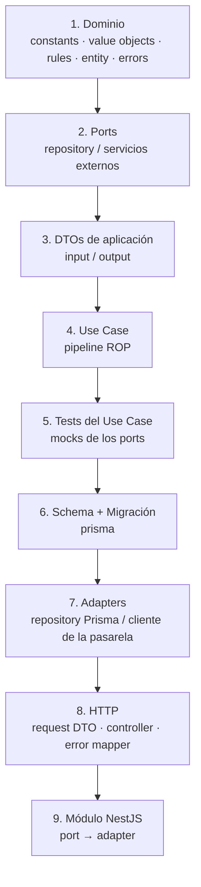
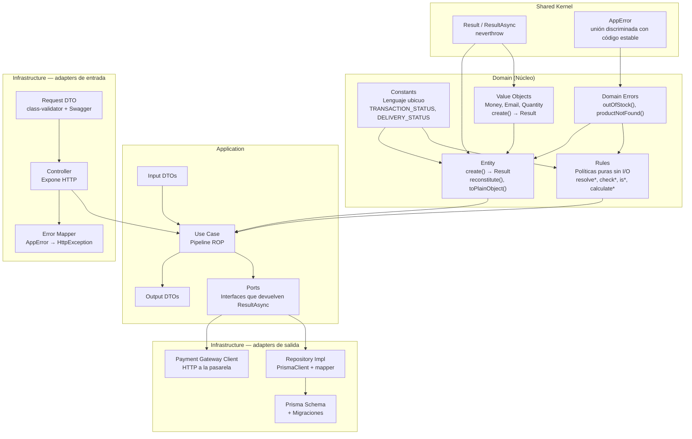
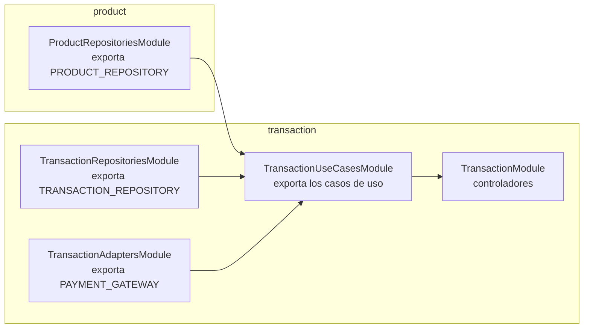
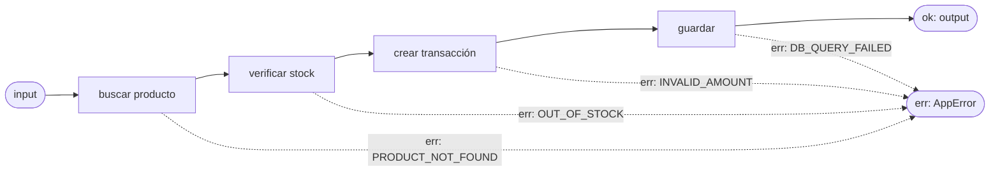
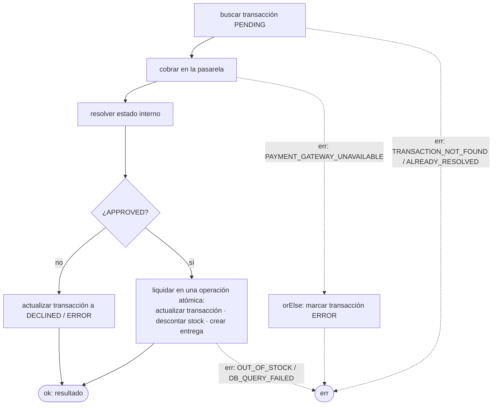

# Flujo de trabajo — Hexagonal + DDD + ROP

Guía de referencia del backend. Explica cómo se organiza el código, en qué orden se construye una funcionalidad y cómo viajan los errores con **Railway Oriented Programming (ROP)**.

## Resumen

- **Hexagonal (Ports & Adapters):** el negocio (`domain` + `application`) no conoce NestJS, Prisma ni HTTP. Habla con el exterior a través de **ports** (interfaces) que implementan los **adapters** de `infrastructure`.
- **DDD:** el negocio se expresa con entidades, value objects, reglas y un lenguaje ubicuo compartido.
- **ROP:** ninguna operación de negocio lanza excepciones. Cada paso devuelve un `Result<Ok, Error>`; los pasos se encadenan y, en cuanto uno falla, los siguientes se saltan y el error viaja hasta el controlador, que es el único que lo traduce a HTTP.

## Flujo de creación



Los tests del caso de uso van en el paso 5, **antes** de la base de datos: como el caso de uso solo depende de ports, se prueba completo con mocks.

## Diagrama Hexagonal + DDD + ROP



## Leyenda de responsabilidades

| Capa | Componente | Responsabilidad |
|------|-----------|----------------|
| **Shared** | Result | Tipos `Result` / `ResultAsync` (neverthrow) y helpers. Es el "riel" por el que viaja todo. |
| **Shared** | AppError | Forma común de todos los errores: `type` (categoría), `code` (estable, lo consume el frontend) y `message`. |
| **Domain** | Constants | Lenguaje ubicuo: catálogos cerrados del negocio como objetos `as const` y sus tipos derivados. No lee `process.env` ni importa DTOs. |
| **Domain** | Value Objects | Valores inmutables con validación (`Money`, `Email`, `Quantity`). `create()` devuelve `Result`, nunca lanza. |
| **Domain** | Rules | Políticas puras: reciben datos ya cargados y deciden. Sin I/O ni repositorios. Devuelven valor, `boolean` o `Result`. |
| **Domain** | Entity | Corazón del negocio: atributos, invariantes y comportamiento. Los métodos que pueden violar una regla devuelven `Result`. |
| **Domain** | Errors | Fábricas de errores de negocio con código estable (`OUT_OF_STOCK`, `TRANSACTION_ALREADY_RESOLVED`). |
| **Application** | Ports | Interfaces de salida (repositorios, pasarela de pagos). Devuelven `ResultAsync`, nunca una `Promise` que pueda rechazarse. |
| **Application** | DTOs | Tipos planos de entrada y salida del caso de uso. Sin decoradores. |
| **Application** | Use Case | Orquesta el flujo como un pipeline ROP: encadena reglas, entidades y ports. Sin decoradores de NestJS. |
| **Infrastructure** | Repository Impl | Implementa el port con Prisma. Envuelve cada llamada en `ResultAsync.fromPromise` y mapea fila ↔ entidad. |
| **Infrastructure** | Payment Gateway Client | Implementa el port de la pasarela. Traduce sus respuestas y fallos de red a `Result`. |
| **Infrastructure** | Prisma Schema | Modelo de datos, migraciones y seed. |
| **Infrastructure** | Request DTO | Contrato HTTP: validación con class-validator y documentación con Swagger. |
| **Infrastructure** | Controller | Único punto de salida del riel: ejecuta el caso de uso y hace `match` → respuesta o `HttpException`. |
| **Infrastructure** | Error Mapper | Traduce `AppError.type` a código HTTP sin filtrar detalles internos. |
| **Application** | UseCase port | Interfaz común `UseCase<Input, Output>`: todo caso de uso expone `execute(input)` y devuelve `ResultAsync`. |
| **Infrastructure** | Providers | `*_PROVIDER`: registran un adapter bajo el token de su port, o un caso de uso con `useCaseProvider`. Viven solo en infraestructura. |
| **Infrastructure** | Modules | Por contexto: `repositories`, `adapters`, `use-cases` y el módulo del contexto con sus controladores. |

## Árbol del patrón arquitectónico

```text
backend/
├── prisma.config.ts                    # CLI de Prisma: esquema, migraciones, seed y DATABASE_URL
├── prisma/
│   ├── schema.prisma                   # Modelo de datos (nombres en inglés, tablas snake_case)
│   ├── migrations/                     # Generadas SOLO con `pnpm db:migrate --name <cambio>`
│   └── seed.ts                         # Productos ficticios (idempotente)
├── src/
│   ├── main.ts                         # Bootstrap HTTP: helmet, CORS, ValidationPipe, Swagger
│   ├── app.module.ts
│   ├── config/                         # Lectura y validación de process.env
│   │
│   ├── shared/                         # KERNEL: no importa ninguna capa
│   │   ├── result/                     # Re-export de neverthrow + helpers ROP
│   │   └── errors/                     # app-error.ts: tipos y fábricas base
│   │
│   ├── domain/                         # NÚCLEO: solo importa shared
│   │   ├── constants/                  # TRANSACTION_STATUS, DELIVERY_STATUS, CARD_BRAND…
│   │   ├── value-objects/              # money.vo.ts, email.vo.ts, quantity.vo.ts
│   │   ├── rules/                      # stock.rules.ts, pricing.rules.ts…
│   │   ├── entities/                   # product.entity.ts, transaction.entity.ts…
│   │   └── errors/                     # product.errors.ts, transaction.errors.ts…
│   │
│   ├── application/                    # ORQUESTACIÓN: importa domain y shared
│   │   ├── ports/                      # use-case.port.ts, <feature>.repository.port.ts, payment-gateway.port.ts
│   │   ├── dtos/<feature>/             # <accion>.input.ts · <feature>.output.ts
│   │   └── use-cases/<feature>/        # <accion>.use-case.ts · <accion>.use-case.spec.ts · <feature>.mapper.ts
│   │
│   └── infrastructure/                 # ADAPTERS: implementan los ports
│       ├── persistence/
│       │   ├── generated/prisma/       # Cliente generado por Prisma (ignorado por Git)
│       │   ├── prisma.service.ts       # Único punto de acceso a Prisma
│       │   ├── database.errors.ts      # databaseError(): fallo de BD → DB_QUERY_FAILED
│       │   ├── repositories/           # <feature>.prisma.repository.ts
│       │   └── mappers/                # <feature>.prisma.mapper.ts: fila ↔ entidad
│       ├── payment-gateway/            # Adapter HTTP de la pasarela
│       │   ├── payment-gateway.client.ts   # Implementa PaymentGatewayPort (+ PAYMENT_GATEWAY_PROVIDER)
│       │   ├── payment-gateway.http.ts     # fetch con timeout; todo fallo → PAYMENT_GATEWAY_UNAVAILABLE
│       │   ├── merchant.response.ts        # Valida la respuesta externa y la traduce al port
│       │   └── payment-gateway.errors.ts
│       ├── settings/                   # Adapters de configuración (checkout-settings.adapter.ts)
│       ├── http/
│       │   ├── controllers/            # <feature>.controller.ts
│       │   ├── dtos/                   # <accion>.request.ts · <feature>.response.ts · error.response.ts (Swagger)
│       │   ├── pipes/                  # parse-uuid.pipe.ts: :id inválido → 400 INVALID_REQUEST
│       │   ├── errors/                 # app-error.http-mapper.ts, validation-exception.factory.ts
│       │   ├── filters/                # all-exceptions.filter.ts: formato único { code, message }
│       │   └── configure-app.ts        # Prefijo, helmet, CORS, validación, Swagger
│       └── modules/                    # CABLEADO de NestJS, un directorio por contexto
│           ├── use-case.provider.ts    # useCaseProvider(): registra casos de uso sin decoradores
│           ├── persistence/            # persistence.module.ts: PrismaService (global)
│           ├── health/                 # health.module.ts
│           ├── payment-gateway/        # payment-gateway.adapters.module.ts: compartido por checkout y transacciones
│           └── <feature>/
│               ├── <feature>.repositories.module.ts   # Adapters de persistencia (exporta sus providers)
│               ├── <feature>.adapters.module.ts       # Otros adapters de salida (p. ej. pasarela)
│               ├── <feature>.use-cases.module.ts      # *_USE_CASE_PROVIDER con useCaseProvider
│               └── <feature>.module.ts                # Controladores; importa el de use-cases
│   │
│   └── testing/                        # SOLO para tests (fuera del build y de la cobertura)
│       ├── fixtures/                   # aProduct(), aProductRow()…: datos válidos con overrides
│       └── mocks/                      # mockProductRepository()…: dobles de los ports
└── test/                               # *.e2e-spec.ts contra PostgreSQL real (requiere migraciones y seed)
```

Módulos del negocio (`<feature>`): `product` (inventario), `customer`, `transaction` y `delivery`.

### Convenciones de nombres

- Archivos en `kebab-case` con sufijo de rol: `.entity.ts`, `.vo.ts`, `.rules.ts`, `.errors.ts`, `.port.ts`, `.use-case.ts`, `.prisma.repository.ts`, `.controller.ts`, `.request.ts`, `.response.ts`, `.repositories.module.ts`, `.adapters.module.ts`, `.use-cases.module.ts`, `.module.ts`.
- Tests unitarios `*.spec.ts` junto al archivo que prueban.
- Clases en `PascalCase`, funciones y variables en `camelCase`, constantes del dominio en `UPPER_SNAKE_CASE`.
- Tokens de inyección de los ports: `export const PRODUCT_REPOSITORY = Symbol('PRODUCT_REPOSITORY')`, junto a la interfaz.
- Providers: `<NOMBRE>_PROVIDER` (`PRODUCT_REPOSITORY_PROVIDER`, `CREATE_TRANSACTION_USE_CASE_PROVIDER`).
- Nombres genéricos para la pasarela: `PaymentGateway`, nunca el nombre comercial del proveedor.

### Regla de dependencias

```text
infrastructure ──► application ──► domain ──► shared
```

Las flechas indican quién puede importar a quién. Ninguna capa importa a una capa a su izquierda. `shared` solo depende de `neverthrow`. Dentro del dominio el orden es:

```text
constants, errors  ──►  value-objects  ──►  rules, entities
```

| Capa | Puede importar | Nunca importa |
|------|----------------|---------------|
| `shared` | `neverthrow` | Ninguna capa, `config`, frameworks |
| `domain` | `shared` | `application`, `infrastructure`, `config`, frameworks |
| `application` | `domain`, `shared` | `infrastructure`, `config`, frameworks |
| `infrastructure` | Todo | — |
| `config` | `class-validator`, `class-transformer` | Solo lo leen `infrastructure`, `app.module.ts` y `main.ts` |

"Frameworks" son `@nestjs/*`, `@prisma/*`, `class-validator`, `class-transformer` y `express`. Si un caso de uso necesita un valor de configuración (por ejemplo, las tarifas), lo pide a un **port** (`CheckoutSettings`) que implementa la infraestructura leyendo `config`.

### Alias de imports

| Alias | Carpeta |
|-------|---------|
| `@shared/*` | `src/shared/*` |
| `@domain/*` | `src/domain/*` |
| `@application/*` | `src/application/*` |
| `@infrastructure/*` | `src/infrastructure/*` |
| `@config/*` | `src/config/*` |
| `@testing/*` | `src/testing/*` (solo desde tests) |

- Entre carpetas distintas se importa **siempre con alias**: `import { appError } from '@shared/errors/app-error'`.
- Las rutas relativas solo se usan entre vecinos cercanos (`./x`, `../x`). Subir dos niveles (`../../`) es error de lint.
- Los alias están definidos en `tsconfig.json` (`paths`) y en `moduleNameMapper` de Jest; `nest build` los reescribe al compilar.
- `@testing` solo se importa desde `*.spec.ts` y `test/`: el lint falla si el código de producción lo usa.

### Cómo se hace cumplir

`eslint.config.mjs` convierte esta tabla en errores de lint. Detecta los imports prohibidos **tanto por alias como por ruta relativa** (`@infrastructure/...` y `../infrastructure/...`), los frameworks en el núcleo y cualquier `throw` en `shared`, `domain` y `application`. Un import que viole la regla de dependencias no puede llegar a `staging`.

## Inyección de dependencias y módulos

El núcleo no conoce NestJS, así que la inyección se resuelve **solo en infraestructura** con tres piezas: tokens, providers y módulos por contexto.

### 1. Tokens: junto al port

Cada port exporta su interfaz y un `Symbol` como token. El `Symbol` es único: dos tokens nunca pueden chocar por tener el mismo texto.

```ts
// application/ports/product.repository.port.ts
export const PRODUCT_REPOSITORY = Symbol('PRODUCT_REPOSITORY');

export interface ProductRepositoryPort {
  findById(id: string): ResultAsync<Product | null, AppError>;
}
```

Los casos de uso implementan el port genérico `UseCase<Input, Output>` y usan **su propia clase como token**.

### 2. Providers: solo en infraestructura

- **Adapters:** el archivo del adapter exporta su provider, que lo registra bajo el token del port.

  ```ts
  // infrastructure/persistence/repositories/product.prisma.repository.ts
  export const PRODUCT_REPOSITORY_PROVIDER: Provider = {
    provide: PRODUCT_REPOSITORY,
    useClass: ProductPrismaRepository,
  };
  ```

- **Casos de uso:** `useCaseProvider` construye la clase inyectando sus ports **en el orden del constructor**. TypeScript exige un token por cada parámetro. Estos providers **nunca** se declaran en `application`: el caso de uso no lleva `@Injectable()` ni `@Inject()`.

  ```ts
  // infrastructure/modules/transaction/transaction.use-cases.module.ts
  export const CREATE_TRANSACTION_USE_CASE_PROVIDER = useCaseProvider(
    CreateTransactionUseCase,
    [PRODUCT_REPOSITORY, CUSTOMER_REPOSITORY, TRANSACTION_REPOSITORY, CHECKOUT_SETTINGS],
  );
  ```

### 3. Módulos por contexto

Cada contexto (`product`, `customer`, `transaction`, `delivery`) tiene su carpeta en `infrastructure/modules/<feature>/` con hasta cuatro módulos. Cada uno solo **exporta** lo que otros necesitan.



| Módulo | Contiene | Exporta |
|--------|----------|---------|
| `<feature>.repositories.module.ts` | `*_REPOSITORY_PROVIDER` del contexto | Los tokens de sus repositorios |
| `<feature>.adapters.module.ts` | Otros adapters de salida (pasarela, configuración) | Los tokens de esos ports |
| `<feature>.use-cases.module.ts` | `*_USE_CASE_PROVIDER`; importa los módulos de repositorios y adapters que necesita, **aunque sean de otro contexto** | Los casos de uso |
| `<feature>.module.ts` | Los controladores; importa su módulo de use-cases | Nada |

- Un contexto usa repositorios de otro importando su `repositories.module`, **nunca** registrando el mismo provider dos veces. Ejemplo: los casos de uso de transacciones importan `ProductRepositoriesModule`.
- `app.module.ts` solo importa los `<feature>.module.ts` y los módulos globales (`ConfigModule`, `ThrottlerModule`, `PersistenceModule`).
- Un contexto crea solo los módulos que necesita: `health` solo tiene `health.module.ts`.

### Qué va en `domain/constants`

| Sí | No |
|----|----|
| Catálogos cerrados del negocio: `TRANSACTION_STATUS` (`PENDING`, `APPROVED`, `DECLINED`, `VOIDED`, `ERROR`), `DELIVERY_STATUS`, `CARD_BRAND` | Funciones que leen `process.env`: van en `config/` |
| Tipos derivados: `type TransactionStatus = (typeof TRANSACTION_STATUS)[keyof typeof TRANSACTION_STATUS]` | Parámetros de paginación: son de `application` |
| Parámetros fijos del negocio: moneda, longitud de referencia | Códigos HTTP, nombres de tablas, URLs de la pasarela |

Los DTOs, adapters y mappers importan estas constantes desde `domain/constants`, nunca al revés.

### Qué va en `domain/rules`

Una regla va en el dominio cuando decide algo del negocio a partir de datos ya cargados, sin consultar a nadie. Hay cuatro formas:

- **Resolver:** `resolveTransactionStatus(gatewayStatus)` devuelve el estado interno, o `null` si no existe la correspondencia.
- **Comprobar (ROP):** `checkStockAvailable(product, quantity)` devuelve `Result<void, AppError>`: `ok` si se cumple, `err(outOfStock())` si no. Sustituye al clásico `assert` que lanza excepción.
- **Consultar:** `isStockAvailable(product, quantity)` devuelve `boolean` sobre la misma regla, útil en listados.
- **Calcular:** `calculateTotal({ productPrice, baseFee, deliveryFee })` devuelve un valor, sin efectos secundarios.

La regla declara su **propia interfaz mínima de entrada** (`interface StockContext { stock: number }`) en lugar de importar un DTO o la entidad completa; entidades y DTOs la satisfacen por tipado estructural. Al no tener I/O, se prueban sin mocks.

Se queda en `application` lo que depende del caso de uso y no del negocio: armado de respuestas (`*.mapper.ts`), paginación y normalización de entrada.

## Railway Oriented Programming

### La idea

Cada operación tiene dos rieles: el de **éxito** y el de **error**. Mientras todo va bien, el valor avanza por el riel de éxito. En cuanto un paso falla, el flujo cambia al riel de error y los pasos siguientes **no se ejecutan**; el error llega intacto al final.



Así se elimina el `try/catch` disperso: el camino feliz se lee de arriba abajo y cada error queda **tipado** en la firma de la función.

### Herramientas (neverthrow)

| Operación | Uso |
|-----------|-----|
| `ok(value)` / `err(error)` | Crear un `Result` síncrono. |
| `okAsync` / `errAsync` / `ResultAsync` | Versión asíncrona; es lo que devuelven los ports y los casos de uso. |
| `.map(fn)` | Transformar el valor con una función que **no puede fallar**. |
| `.andThen(fn)` | Encadenar un paso que **puede fallar** (devuelve `Result` o `ResultAsync`). |
| `.mapErr(fn)` | Transformar o enriquecer el error. |
| `.orElse(fn)` | Recuperarse de un error o ejecutar una compensación. |
| `.match(onOk, onErr)` | Salir del riel. Solo se usa en el controlador. |
| `Result.combine([...])` | Validar varias cosas y obtener todos los valores o el primer error. |
| `ResultAsync.fromPromise` / `Result.fromThrowable` | Envolver código que lanza (Prisma, fetch). Solo en adapters. |

### Reglas

1. `domain` y `application` **no lanzan** excepciones por errores de negocio: devuelven `err(...)`.
2. `throw` se reserva para bugs de programación (estados imposibles). Los captura el filtro global de NestJS y responden 500.
3. Los **adapters son la frontera**: toda llamada que puede lanzar (Prisma, HTTP a la pasarela) se envuelve con `fromPromise` y su fallo se traduce a `AppError`.
4. Los **ports devuelven `ResultAsync<T, AppError>`**, nunca una `Promise` que pueda rechazarse.
5. Solo la capa HTTP sale del riel: `match` → respuesta, o `HttpException` mediante el error mapper.
6. Los errores tienen un `code` **estable** (`OUT_OF_STOCK`); el frontend reacciona al código, no al mensaje.
7. Cada caso de uso se prueba en el camino feliz **y en cada rama de error**, verificando que los pasos posteriores no se ejecutaron.

### Modelo de errores

```ts
// shared/errors/app-error.ts
export type AppErrorType =
  | 'VALIDATION'
  | 'NOT_FOUND'
  | 'CONFLICT'
  | 'EXTERNAL_SERVICE'
  | 'INFRASTRUCTURE';

export interface AppError {
  readonly type: AppErrorType;
  readonly code: string;
  readonly message: string;
  readonly cause?: unknown;
}

export const appError = (
  type: AppErrorType,
  code: string,
  message: string,
  cause?: unknown,
): AppError => ({ type, code, message, cause });
```

```ts
// domain/errors/product.errors.ts
export const productNotFound = (id: string) =>
  appError('NOT_FOUND', 'PRODUCT_NOT_FOUND', `Product ${id} not found`);

export const outOfStock = () =>
  appError('CONFLICT', 'OUT_OF_STOCK', 'Not enough units available');
```

| `AppError.type` | HTTP | Ejemplos de `code` |
|-----------------|------|--------------------|
| `VALIDATION` | 422 | `INVALID_AMOUNT`, `INVALID_EMAIL` |
| `NOT_FOUND` | 404 | `PRODUCT_NOT_FOUND`, `TRANSACTION_NOT_FOUND` |
| `CONFLICT` | 409 | `OUT_OF_STOCK`, `TRANSACTION_ALREADY_RESOLVED` |
| `EXTERNAL_SERVICE` | 502 | `PAYMENT_GATEWAY_UNAVAILABLE`, `PAYMENT_GATEWAY_REJECTED` |
| `INFRASTRUCTURE` | 500 | `DB_QUERY_FAILED` |

La validación de **formato** de la petición (campos obligatorios, tipos) la hace el `ValidationPipe` con class-validator y responde 400 antes de llegar al caso de uso. La validación de **negocio** vive en el dominio y viaja por el riel.

## Ejemplo completo: crear una transacción

### 1. Dominio

```ts
// domain/rules/stock.rules.ts
export interface StockContext {
  stock: number;
}

export const checkStockAvailable = (
  product: StockContext,
  quantity: number,
): Result<void, AppError> =>
  product.stock >= quantity ? ok(undefined) : err(outOfStock());
```

```ts
// domain/entities/transaction.entity.ts
export class Transaction {
  private constructor(private readonly props: TransactionProps) {}

  static create(input: NewTransaction): Result<Transaction, AppError> {
    return Money.create(input.amountInCents).map(
      (amount) =>
        new Transaction({ ...input, amount, status: TRANSACTION_STATUS.PENDING }),
    );
  }

  static reconstitute(props: TransactionProps): Transaction {
    return new Transaction(props);
  }

  resolve(status: TransactionStatus): Result<Transaction, AppError> {
    if (this.props.status !== TRANSACTION_STATUS.PENDING) {
      return err(transactionAlreadyResolved(this.props.id));
    }
    return ok(new Transaction({ ...this.props, status }));
  }

  toPlainObject(): TransactionProps {
    return { ...this.props };
  }
}
```

### 2. Port

```ts
// application/ports/product.repository.port.ts
export const PRODUCT_REPOSITORY = Symbol('PRODUCT_REPOSITORY');

export interface ProductRepositoryPort {
  findById(id: string): ResultAsync<Product | null, AppError>;
}
```

### 3. Use Case

```ts
// application/use-cases/transaction/create-transaction.use-case.ts
export class CreateTransactionUseCase
  implements UseCase<CreateTransactionInput, TransactionOutput>
{
  constructor(
    private readonly products: ProductRepositoryPort,
    private readonly transactions: TransactionRepositoryPort,
  ) {}

  execute(input: CreateTransactionInput): ResultAsync<TransactionOutput, AppError> {
    return this.products
      .findById(input.productId)
      .andThen((product) =>
        product ? ok(product) : err(productNotFound(input.productId)),
      )
      .andThen((product) =>
        checkStockAvailable(product.toPlainObject(), input.quantity).map(() => product),
      )
      .andThen((product) =>
        Transaction.create({
          productId: product.id,
          customerId: input.customerId,
          amountInCents: calculateTotal({
            productPrice: product.priceInCents * input.quantity,
            baseFee: input.baseFeeInCents,
            deliveryFee: input.deliveryFeeInCents,
          }),
        }),
      )
      .andThen((transaction) => this.transactions.save(transaction))
      .map(toTransactionOutput);
  }
}
```

El caso de uso **no tiene decoradores de NestJS**: implementa `UseCase`, recibe los ports por constructor y la infraestructura lo registra con `useCaseProvider`.

### 4. Test del Use Case

```ts
it('devuelve OUT_OF_STOCK y no guarda nada si no hay unidades', async () => {
  products.findById.mockReturnValue(okAsync(aProduct({ stock: 0 })));

  const result = await useCase.execute(aCreateTransactionInput({ quantity: 1 }));

  expect(result.isErr()).toBe(true);
  expect(result._unsafeUnwrapErr().code).toBe('OUT_OF_STOCK');
  expect(transactions.save).not.toHaveBeenCalled();
});
```

### 5. Adapter de persistencia

```ts
// infrastructure/persistence/repositories/product.prisma.repository.ts
@Injectable()
export class ProductPrismaRepository implements ProductRepositoryPort {
  constructor(private readonly prisma: PrismaService) {}

  findById(id: string): ResultAsync<Product | null, AppError> {
    return ResultAsync.fromPromise(
      this.prisma.product.findUnique({ where: { id } }),
      (cause) => appError('INFRASTRUCTURE', 'DB_QUERY_FAILED', 'Database query failed', cause),
    ).map((row) => (row ? ProductPrismaMapper.toDomain(row) : null));
  }
}

export const PRODUCT_REPOSITORY_PROVIDER: Provider = {
  provide: PRODUCT_REPOSITORY,
  useClass: ProductPrismaRepository,
};
```

### 6. Controller y error mapper

```ts
// infrastructure/http/errors/app-error.http-mapper.ts
const STATUS_BY_TYPE: Record<AppErrorType, HttpStatus> = {
  VALIDATION: HttpStatus.UNPROCESSABLE_ENTITY,
  NOT_FOUND: HttpStatus.NOT_FOUND,
  CONFLICT: HttpStatus.CONFLICT,
  EXTERNAL_SERVICE: HttpStatus.BAD_GATEWAY,
  INFRASTRUCTURE: HttpStatus.INTERNAL_SERVER_ERROR,
};

export const toHttpException = (error: AppError): HttpException =>
  new HttpException(
    { code: error.code, message: error.message },
    STATUS_BY_TYPE[error.type],
  );

export const unwrapOrThrowHttp = async <T>(result: ResultAsync<T, AppError>): Promise<T> =>
  (await result).match(
    (value) => value,
    (error) => {
      throw toHttpException(error);
    },
  );
```

```ts
// infrastructure/http/controllers/transaction.controller.ts
@Post()
create(@Body() body: CreateTransactionRequest): Promise<TransactionResponse> {
  return unwrapOrThrowHttp(this.createTransaction.execute(body));
}
```

La respuesta de error nunca incluye `cause`: los detalles internos se registran en el log, no se envían al cliente.

### 7. Módulo

```ts
// infrastructure/modules/product/product.repositories.module.ts
const providers = [PRODUCT_REPOSITORY_PROVIDER];

@Module({ providers, exports: providers })
export class ProductRepositoriesModule {}
```

```ts
// infrastructure/modules/transaction/transaction.use-cases.module.ts
export const CREATE_TRANSACTION_USE_CASE_PROVIDER = useCaseProvider(
  CreateTransactionUseCase,
  [PRODUCT_REPOSITORY, TRANSACTION_REPOSITORY],
);

const providers = [CREATE_TRANSACTION_USE_CASE_PROVIDER];

@Module({
  imports: [ProductRepositoriesModule, TransactionRepositoriesModule],
  providers,
  exports: providers,
})
export class TransactionUseCasesModule {}
```

```ts
// infrastructure/modules/transaction/transaction.module.ts
@Module({
  imports: [TransactionUseCasesModule],
  controllers: [TransactionController],
})
export class TransactionModule {}
```

El controlador inyecta el caso de uso por su clase (`constructor(private readonly createTransaction: CreateTransactionUseCase)`), que es su token.

## El riel del pago

El caso de uso más importante es el que procesa el pago. Tiene una particularidad: si la pasarela falla **después** de crear la transacción en `PENDING`, la transacción no puede quedarse colgada. Se usa `orElse` como **compensación**: registra el fallo y vuelve a emitir el error.



- Un pago **rechazado** no es un error del riel: es un resultado de negocio válido (`DECLINED`) y viaja por el riel de éxito.
- El **inventario solo se descuenta si el pago queda aprobado**, y la actualización de la transacción, el descuento de stock y la creación de la entrega van en la misma transacción de base de datos (`prisma.$transaction`) dentro de un único método del adapter.

## Teoría

Cuando se trabaja desde cero una funcionalidad, el flujo arranca así:

**Entidad de dominio.** Defines la entidad con sus atributos, invariantes y métodos (`create()`, `reconstitute()`, `toPlainObject()`), sin que conozca nada del mundo exterior. `create()` valida y devuelve un `Result`; `reconstitute()` reconstruye desde la base de datos sin volver a validar, porque esos datos ya fueron válidos al guardarse.

**Constants, Value Objects y Rules.** Las constantes fijan el lenguaje ubicuo (`PENDING`, `APPROVED`, `DELIVERED`) que comparten todas las capas. Los value objects encapsulan valores con reglas propias, como un monto que no puede ser negativo. Las reglas son funciones puras que toman decisiones que no pertenecen a una sola entidad, por ejemplo si hay stock suficiente. Al no tener I/O se prueban sin mocks.

**Errores de dominio.** Cada forma de fallar del negocio tiene una fábrica con código estable. Son valores, no excepciones: forman parte de la firma de las funciones.

**El Port** es una promesa: una interfaz que dice "alguien me va a proporcionar esta funcionalidad, pero no sé quién". Como devuelve `ResultAsync`, el caso de uso sabe que la operación puede fallar y cómo, sin conocer Prisma ni HTTP.

**Los DTOs de aplicación** son tipos planos que describen qué entra y qué sale del caso de uso, independientes del contrato HTTP.

**El Use Case** orquesta el flujo como un pipeline: cada paso es un `andThen` o un `map`. No hay `try/catch` ni `if (error) return`; el riel se encarga de cortar el flujo en el primer fallo. Aquí se escriben los tests, con mocks de los ports, cubriendo el camino feliz y cada rama de error.

Con el caso de uso validado, llega el momento de la persistencia: se crea o actualiza el modelo en `schema.prisma`, se genera la migración y Prisma crea las tablas.

**El Repository** es quien se ensucia las manos: implementa el port con PrismaClient, envuelve cada consulta con `ResultAsync.fromPromise` para que nada lance, y mapea fila ↔ entidad. El **cliente de la pasarela** hace lo mismo con las llamadas HTTP externas.

**El Controller** recibe la petición ya validada por el request DTO, ejecuta el caso de uso y sale del riel: si es `ok` devuelve la respuesta; si es `err`, el error mapper lo convierte en el código HTTP correspondiente.

**El Módulo** conecta todo: asocia cada token de port con su adapter y construye los casos de uso inyectándoles los ports.

Cada capa tiene una única responsabilidad, y cada error tiene un tipo y un código: cuando algo falla, sabes exactamente dónde buscar.

## Por qué cumple Hexagonal + DDD + ROP

### Hexagonal (Ports & Adapters)

| Principio | Cómo se cumple |
|-----------|----------------|
| **Núcleo aislado** | `domain` y `application` no importan NestJS, Prisma ni class-validator. Los casos de uso no tienen decoradores. |
| **Ports** | Las interfaces de `application/ports` son propiedad del núcleo, no del adapter. |
| **Adapters** | Repositorios Prisma, cliente de la pasarela (salida) y controladores HTTP (entrada) se pueden cambiar sin tocar el negocio. |
| **Inversión de dependencias** | La aplicación define el contrato y la infraestructura lo implementa; el módulo los conecta con tokens de inyección. |

### Domain-Driven Design

| Principio | Cómo se cumple |
|-----------|----------------|
| **Aggregate Root** | Entidades con constructor privado, `create()` y `reconstitute()` garantizan que no existan instancias inválidas. |
| **Value Objects** | `Money`, `Email`, `Quantity`: inmutables, validados al crearse. |
| **Lógica en el dominio** | `resolve()`, `checkStockAvailable()`: las reglas viven en entidades y reglas puras, no en servicios anémicos. |
| **Lenguaje ubicuo** | `domain/constants` define una sola vez los términos del negocio. |
| **Repository Pattern** | Los ports de repositorio abstraen el almacenamiento y devuelven entidades completas. |

### Railway Oriented Programming

| Principio | Cómo se cumple |
|-----------|----------------|
| **Errores como valores** | Toda operación de negocio devuelve `Result` / `ResultAsync`; el tipo de error forma parte de la firma. |
| **Composición** | Los casos de uso son cadenas de `andThen` / `map`: el camino feliz se lee de arriba abajo. |
| **Cortocircuito** | En el primer `err` los pasos siguientes no se ejecutan; los tests lo verifican. |
| **Fronteras explícitas** | Solo los adapters convierten excepciones en `err`, y solo el controlador convierte `err` en HTTP. |
| **Compensación** | `orElse` deja consistente el estado cuando un servicio externo falla a mitad del flujo. |

## Checklist de revisión

- [ ] Los datos de prueba salen de `@testing/fixtures` y los dobles de los ports de `@testing/mocks`; ningún archivo de producción importa `@testing`.
- [ ] `domain/` y `application/` no importan `@nestjs/*`, `@prisma/client`, `class-validator`, `config` ni `infrastructure/`.
- [ ] `domain/` no importa `application/`.
- [ ] Los imports entre carpetas usan alias (`@shared`, `@domain`, `@application`, `@infrastructure`, `@config`).
- [ ] Los casos de uso implementan `UseCase<Input, Output>` y no tienen decoradores; se registran con `useCaseProvider` en su `<feature>.use-cases.module.ts`.
- [ ] Ningún provider se registra dos veces: los repositorios de otro contexto se obtienen importando su `repositories.module`.
- [ ] No hay `throw` de negocio en `domain/` ni `application/`.
- [ ] Los ports devuelven `ResultAsync<T, AppError>`.
- [ ] Toda llamada a Prisma o a la pasarela está envuelta con `fromPromise` / `fromThrowable`.
- [ ] Los controladores no tienen lógica: validan, ejecutan el caso de uso y salen del riel con `unwrapOrThrowHttp`.
- [ ] Cada caso de uso tiene test del camino feliz y de cada rama de error.
- [ ] El nombre comercial de la pasarela no aparece en el código.

Comprobación automática desde `backend/`:

```bash
pnpm typecheck && pnpm lint && pnpm test:cov
```

`eslint.config.mjs` convierte las reglas de este checklist en errores de lint: `shared`, `domain` y `application` no pueden importar frameworks (`@nestjs/*`, `@prisma/*`, `class-validator`, `class-transformer`, `express`) ni capas exteriores, y no pueden usar `throw`. `test:cov` falla si la cobertura baja del 80%.
