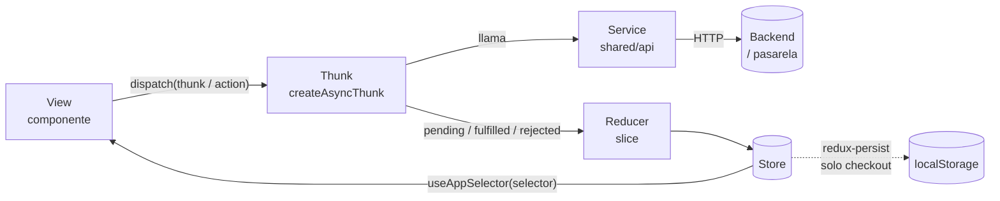
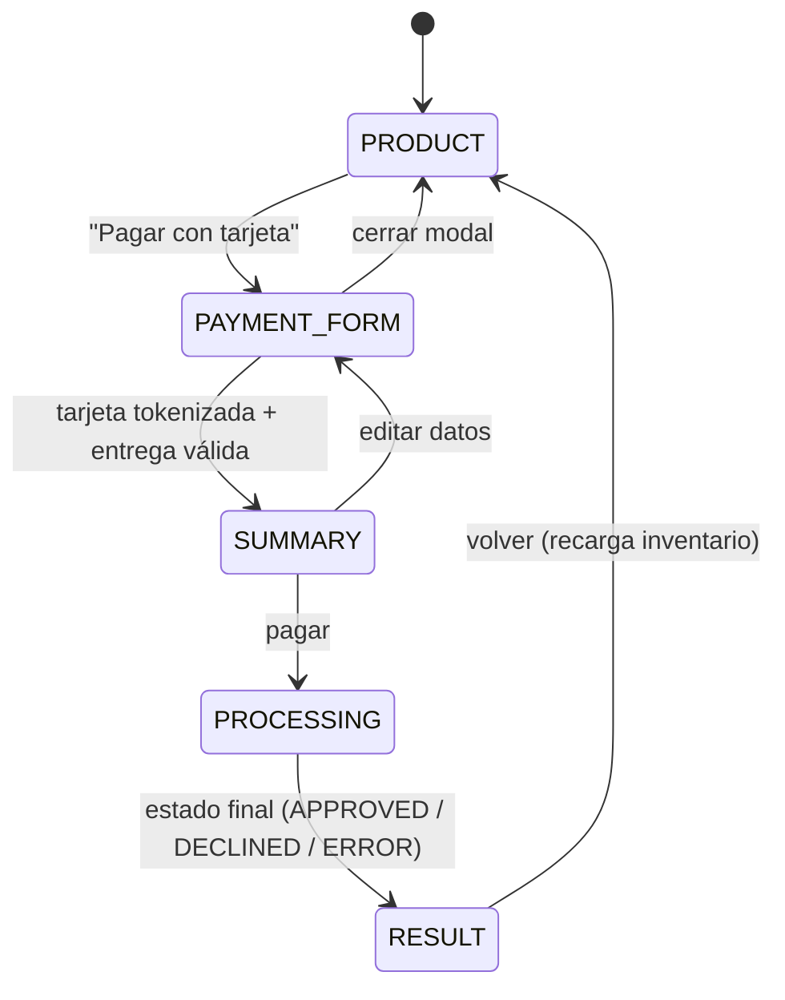

# Arquitectura del frontend — SPA + Redux (Flux)

Guía de referencia del frontend. Explica cómo se organiza el código, cómo fluye el estado con Redux siguiendo Flux, cómo sobrevive el checkout a un refresh y qué reglas cumplir en UI, imágenes, seguridad y tests.

## Resumen

- **SPA con ReactJS:** React puro, empaquetado con **Vite** (herramienta de build, no framework). El enunciado solo permite React o Vue y prohíbe expresamente Next.js y otros frameworks. `vite build` genera archivos estáticos que sirve Nginx; toda la lógica de negocio y los datos viven en el backend.
- **Flux con Redux Toolkit:** la vista nunca habla con la API. Despacha acciones o thunks; los thunks llaman a servicios; los reducers actualizan el store; la vista lee con selectores.
- **Checkout como máquina de pasos:** el paso actual vive en el store y se persiste. Al refrescar, la app vuelve exactamente al paso en que estaba el cliente.
- **Separación por features:** `products`, `checkout` y `transaction`. La lógica pura (tarjeta, formatos, cálculos) vive en `shared/lib` y se prueba sin React.

## Flujo Flux



El flujo es siempre **unidireccional**. Un componente que necesite datos del servidor despacha un thunk; nunca llama a `fetch` directamente.

## Máquina de pasos del checkout

Las cinco pantallas del enunciado son estados de una máquina guardada en `checkout.slice`:



| Paso | Pantalla del enunciado | Cómo se muestra |
|------|------------------------|-----------------|
| `PRODUCT` | 1 y 5. Página del producto | Página principal |
| `PAYMENT_FORM` | 2. Tarjeta y entrega | Modal sobre la página del producto |
| `SUMMARY` | 3. Resumen del pago | Backdrop sobre la página del producto |
| `PROCESSING` | Transición mientras se paga | Backdrop con indicador de carga |
| `RESULT` | 4. Estado final | Pantalla de resultado |

Reglas:

- **Sin router:** la pantalla visible se deriva **solo** de `checkout.step`. El store es la única fuente de verdad, así que una URL nunca puede contradecir el paso persistido tras un refresh. Nginx sirve siempre `index.html`.
- Las transiciones se hacen **solo** con acciones del slice (`goToStep`, `resetCheckout`) o en los `fulfilled` de los thunks. Un componente nunca escribe el paso "a mano".
- Al rehidratar en `PROCESSING` con un `transactionId`, la app **reanuda la consulta del estado** de la transacción en vez de volver a cobrar.
- `resetCheckout` al volver a `PRODUCT` limpia el checkout y vuelve a pedir el producto para mostrar el inventario actualizado.

## Qué se persiste y qué no

| Se persiste (`localStorage`) | **Nunca** se persiste |
|------------------------------|-----------------------|
| Paso actual | Número de tarjeta completo |
| Producto y cantidad elegidos | CVC |
| Datos de entrega | Llave privada o de integridad (no existen en el front) |
| Token de la tarjeta, marca y últimos 4 dígitos | Respuestas crudas de la pasarela |
| Tarifas calculadas del resumen | |
| `transactionId` y estado de la transacción | |

- `redux-persist` se configura con **`whitelist: ['checkout']`**. Los productos se vuelven a pedir siempre, para que el inventario no quede desactualizado.
- El número de tarjeta y el CVC viven solo en el **estado local del formulario**. En cuanto se tokenizan, se descartan: al store llega solo el token, la marca y los últimos 4 dígitos.
- Los datos que se guardan en `localStorage` quedan en el navegador del cliente: nada que no sea necesario para reanudar el flujo.

## Árbol del patrón arquitectónico

```text
frontend/
├── index.html                          # Punto de entrada HTML de Vite
├── vite.config.ts                      # Plugin de React, alias y servidor de desarrollo
├── jest.config.ts                      # Jest + jsdom, alias y umbral de cobertura
├── public/
│   └── images/                         # Imágenes optimizadas (WebP) y logos de marcas de tarjeta
├── src/
│   ├── main.tsx                        # Arranque: createRoot + <App />
│   ├── app/                            # SOLO composición
│   │   ├── App.tsx                     # Elige la pantalla según checkout.step
│   │   └── Providers.tsx               # Provider de Redux + PersistGate
│   │
│   ├── features/                       # Un directorio por dominio de la UI
│   │   ├── products/
│   │   │   ├── components/             # ProductCard.tsx, ProductGallery.tsx…
│   │   │   ├── products.slice.ts
│   │   │   ├── products.thunks.ts
│   │   │   ├── products.selectors.ts
│   │   │   └── index.ts                # API pública de la feature
│   │   ├── checkout/
│   │   │   ├── components/             # CheckoutModal, CardForm, DeliveryForm, SummaryBackdrop
│   │   │   ├── checkout.slice.ts       # Máquina de pasos + datos del checkout
│   │   │   ├── checkout.thunks.ts      # tokenizeCard, createTransaction, payTransaction
│   │   │   ├── checkout.selectors.ts
│   │   │   └── index.ts
│   │   └── transaction/
│   │       ├── components/             # TransactionResult.tsx
│   │       ├── transaction.thunks.ts   # pollTransactionStatus
│   │       └── index.ts
│   │
│   ├── shared/                         # No importa nada de features/ ni app/
│   │   ├── ui/                         # Button, Input, Modal, Backdrop, Spinner, CardBrandIcon
│   │   ├── lib/
│   │   │   ├── card/                   # luhn.ts, card-brand.ts, expiry.ts, cvc.ts
│   │   │   ├── format/                 # currency.ts
│   │   │   └── pricing/                # summary.ts: total = producto + tarifa base + envío
│   │   ├── api/
│   │   │   ├── http-client.ts          # fetch con baseURL, timeout y errores normalizados
│   │   │   ├── products.api.ts
│   │   │   ├── transactions.api.ts
│   │   │   └── payment-gateway.api.ts  # Tokenización con la llave pública
│   │   ├── hooks/                      # useMediaQuery, useFocusTrap…
│   │   └── config/env.ts               # ÚNICO lugar que lee import.meta.env (VITE_*)
│   │
│   └── store/
│       ├── index.ts                    # configureStore + persistReducer + persistor
│       ├── root-reducer.ts
│       └── hooks.ts                    # useAppDispatch, useAppSelector tipados
└── test/
    ├── render-with-store.tsx           # Helper de React Testing Library con store real
    └── fixtures/                       # Productos, transacciones y tarjetas de prueba
```

### Regla de dependencias

```text
app ──► features ──► shared
          │
          └──► store
```

- `shared/` no importa nada de `features/`, `store/` ni `app/`.
- Una feature importa otra **solo a través de su `index.ts`**, nunca de sus archivos internos.
- `app/` solo compone: elige qué feature mostrar según el paso. Sin lógica de negocio.
- Los componentes no importan `shared/api/`: el acceso a datos pasa siempre por un thunk.

### Convenciones de nombres

- Componentes en `PascalCase.tsx`, un componente por archivo.
- Resto de archivos en `kebab-case` con sufijo de rol: `.slice.ts`, `.thunks.ts`, `.selectors.ts`, `.api.ts`.
- Hooks con prefijo `use`.
- Tests `*.test.ts(x)` junto al archivo que prueban.
- La pasarela se nombra de forma genérica (`paymentGateway`), nunca con su nombre comercial.

## Componentes

- **Contenedor vs. presentacional:** el componente raíz de cada pantalla (`CheckoutModal`, `SummaryBackdrop`) lee el store y despacha. Sus hijos (`CardForm`, `SummaryRow`) reciben props y emiten callbacks: no conocen Redux, y por eso se prueban fácil.
- Toda lógica que no sea de presentación (validar tarjeta, calcular el total, formatear moneda) se extrae a `shared/lib` como función pura.
- **Accesibilidad:** el modal y el backdrop atrapan el foco, se cierran con `Escape`, usan `role="dialog"` y `aria-modal`. Cada input tiene `label`, y los errores se anuncian con `aria-describedby`.

## Validación de tarjeta

| Campo | Regla | Archivo |
|-------|-------|---------|
| Número | Solo dígitos, longitud 13–19, **algoritmo de Luhn** | `shared/lib/card/luhn.ts` |
| Marca | VISA empieza por `4`; MasterCard por `51–55` o `2221–2720` | `shared/lib/card/card-brand.ts` |
| Vencimiento | Formato `MM/AA`, mes 01–12, no vencida | `shared/lib/card/expiry.ts` |
| CVC | 3 dígitos (4 si la marca lo exige) | `shared/lib/card/cvc.ts` |
| Titular | Obligatorio, solo letras y espacios | Formulario |

La marca se detecta **mientras se escribe** y se muestra su logo; el número se formatea en grupos de 4.

## UI responsive (mobile first)

- Diseñar primero para **375 × 667 px** (iPhone SE 2020) y ampliar con los prefijos de Tailwind `sm:`, `md:`, `lg:`.
- Layout con **flexbox o grid**; nada de anchos fijos en px en contenedores. Usar `max-w-*`, `w-full` y `min-w-0` en hijos flex con texto largo.
- El modal en móvil ocupa la pantalla (tipo *bottom sheet*); en escritorio es una tarjeta centrada.
- Objetivos táctiles de al menos 44 × 44 px. Inputs con `inputMode="numeric"` y `autoComplete` (`cc-number`, `cc-exp`, `cc-csc`).
- Probar en Chrome, Firefox y Safari (móvil y escritorio): suma el bonus de compatibilidad entre navegadores.

## Imágenes (criterio de 5 puntos)

React no optimiza imágenes por sí solo: la optimización se hace al preparar los archivos y al usarlos.

- Servir **WebP** ya redimensionado al tamaño máximo en que se muestra, con `srcSet`/`sizes` si hay varias resoluciones.
- Siempre `width` y `height` (o `aspect-ratio`) para reservar el espacio y evitar saltos de layout.
- `object-fit: cover`/`contain` y `max-w-full`: la imagen nunca se sale de su contenedor.
- `loading="lazy"` en imágenes fuera de la primera pantalla y `fetchPriority="high"` en la principal del producto.
- Logos de marcas de tarjeta en **SVG**.

## Seguridad

- Vite incrusta en el bundle toda variable `VITE_*`, así que es **pública**. Solo van la URL del backend, la URL de tokenización y la **llave pública**. Nunca una llave privada.
- Nunca usar `dangerouslySetInnerHTML`.
- El número de tarjeta y el CVC no se loguean, no se guardan y no se envían al backend: solo a la tokenización.
- Las cabeceras de seguridad (CSP, HSTS…) las pone Nginx.

## React + Vite: detalles a tener en cuenta

- **Solo React.** Prohibido cualquier framework (Next.js, Remix, React Router en modo framework, Gatsby…). Vite solo empaqueta; no aporta rutas, servidor ni renderizado.
- **Variables de entorno:** solo se leen en `shared/config/env.ts`. `import.meta.env` no existe en Jest (CommonJS), así que Jest sustituye ese módulo por uno de prueba (`moduleNameMapper`). Ningún otro archivo usa `import.meta.env`.
- **Tests con Jest, no Vitest:** Vite trae Vitest por defecto, pero el enunciado exige Jest. Jest usa `ts-jest` con entorno `jsdom`; los imports de CSS e imágenes se sustituyen por mocks.
- **Rehidratación:** `PersistGate` muestra un indicador de carga hasta recuperar el estado de `localStorage`, para no pintar un paso equivocado durante un instante.
- **Build:** `vite build` genera `dist/` con archivos con hash en el nombre, que Nginx puede cachear mucho tiempo. `index.html` no se cachea.

## Tests

| Qué | Cómo | Objetivo |
|-----|------|----------|
| `shared/lib/*` | Tests unitarios puros, tabla de casos (`it.each`) | 100% |
| Slices | Reducer + acciones: estado inicial, cada transición, `pending`/`fulfilled`/`rejected` | 100% |
| Thunks | Servicios de `shared/api` mockeados con `jest.mock`; se verifican las acciones despachadas | Camino feliz y error |
| Selectores | Estado de entrada → valor esperado | 100% |
| Componentes | React Testing Library con `renderWithStore`: interacción del usuario, no detalles internos | Flujos principales |
| `shared/api` | `fetch` mockeado: URL, método, cuerpo y manejo de errores | Camino feliz y error |

- Umbral en `jest.config.ts`: `coverageThreshold.global` de **80** en líneas, ramas, funciones y sentencias.
- Excluir de la cobertura solo lo que no tiene lógica: `main.tsx`, `shared/config/env.ts`, archivos `index.ts` que solo re-exportan y tipos.
- Consultar por rol y texto (`getByRole`, `getByLabelText`), no por clases CSS.

## Checklist de revisión

- [ ] Ningún componente llama a `fetch` ni importa `shared/api/`.
- [ ] El paso del checkout solo cambia mediante acciones del slice.
- [ ] Refrescar en cualquier paso devuelve al mismo paso con sus datos.
- [ ] El store y `localStorage` no contienen el número de tarjeta ni el CVC.
- [ ] Nada se desborda a 375 px de ancho.
- [ ] Toda imagen tiene dimensiones reservadas y está en WebP o SVG.
- [ ] `shared/` no importa de `features/`, `store/` ni `app/`.
- [ ] Cobertura por encima del 80%.
- [ ] `import.meta.env` solo aparece en `shared/config/env.ts`.
- [ ] Ninguna dependencia es un framework (Next.js, Remix, Gatsby…).
- [ ] El nombre comercial de la pasarela no aparece en el código.

Comprobación rápida desde `frontend/`:

```bash
grep -rnE "fetch\(|shared/api" src/features/*/components src/app
grep -rnE "from '.*(features|store|app)/" src/shared
grep -rnE "cardNumber|cvc" src/store src/features/*/*.slice.ts
grep -rln "import.meta.env" src | grep -v "shared/config/env.ts"
```

Las cuatro deben devolver cero resultados. En el store de la tarjeta solo existen `token`, `brand` y `last4`.
