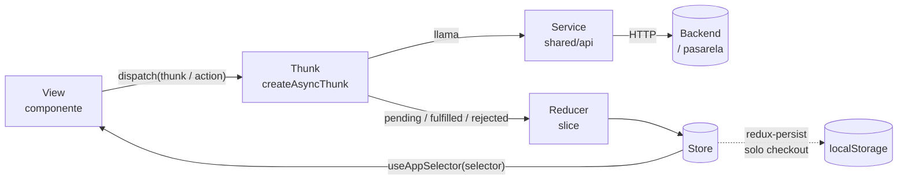
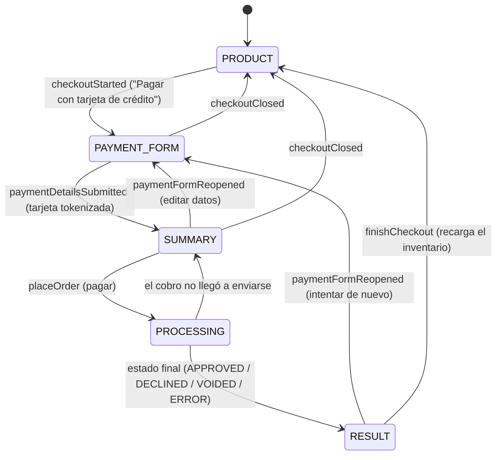

# Arquitectura del frontend — SPA + Redux (Flux)

Guía de referencia del frontend. Explica cómo se organiza el código, cómo fluye el estado con Redux siguiendo Flux, cómo sobrevive el checkout a un refresh y qué reglas cumplir en UI, imágenes, seguridad y tests.

## Resumen

- **SPA con ReactJS:** React puro, empaquetado con **Vite** (herramienta de build, no framework). El enunciado solo permite React o Vue y prohíbe expresamente Next.js y otros frameworks. `vite build` genera archivos estáticos que sirve Nginx; toda la lógica de negocio y los datos viven en el backend.
- **Flux con Redux Toolkit:** la vista nunca habla con la API. Despacha acciones o thunks; los thunks llaman a servicios; los reducers actualizan el store; la vista lee con selectores.
- **Checkout como máquina de pasos:** el paso actual vive en el store y se persiste. Al refrescar, la app vuelve exactamente al paso en que estaba el cliente.
- **Separación por features:** `products`, `checkout` y `transaction`. La lógica pura (tarjeta, formatos, cálculos) vive en `shared/lib` y se prueba sin React.

## Flujo Flux


```mermaid
flowchart LR
    V["View<br/>componente"] -- "dispatch(thunk / action)" --> T["Thunk<br/>createAsyncThunk"]
    T -- "llama" --> S["Service<br/>shared/api"]
    S -- "HTTP" --> API[("Backend<br/>/ pasarela")]
    T -- "pending / fulfilled / rejected" --> R["Reducer<br/>slice"]
    R --> ST[("Store")]
    ST -- "useAppSelector(selector)" --> V
    ST -. "redux-persist<br/>solo checkout" .-> LS[("localStorage")]
```

El flujo es siempre **unidireccional**. Un componente que necesite datos del servidor despacha un thunk; nunca llama a `fetch` directamente.

## Máquina de pasos del checkout

Las cinco pantallas del enunciado son estados de una máquina guardada en `checkout.slice`:


```mermaid
stateDiagram-v2
    [*] --> PRODUCT
    PRODUCT --> PAYMENT_FORM: checkoutStarted ("Pagar con tarjeta de crédito")
    PAYMENT_FORM --> PRODUCT: checkoutClosed
    PAYMENT_FORM --> SUMMARY: paymentDetailsSubmitted (tarjeta tokenizada)
    SUMMARY --> PAYMENT_FORM: paymentFormReopened (editar datos)
    SUMMARY --> PRODUCT: checkoutClosed
    SUMMARY --> PROCESSING: placeOrder (pagar)
    PROCESSING --> SUMMARY: el cobro no llegó a enviarse
    PROCESSING --> RESULT: estado final (APPROVED / DECLINED / VOIDED / ERROR)
    RESULT --> PAYMENT_FORM: paymentFormReopened (intentar de nuevo)
    RESULT --> PRODUCT: finishCheckout (recarga el inventario)
```

| Paso | Pantalla del enunciado | Cómo se muestra |
|------|------------------------|-----------------|
| `PRODUCT` | 1. Página del producto | Catálogo con stock y botón de pago |
| `PAYMENT_FORM` | 2. Tarjeta y entrega | Modal sobre el catálogo |
| `SUMMARY` | 3. Resumen del pago | Backdrop: desglose, contratos y botón de pago |
| `PROCESSING` | 4. Procesamiento | Backdrop que no se puede cerrar, con el avance del pago |
| `RESULT` | 5. Resultado | Backdrop con el resultado; al cerrarlo, vuelve al catálogo con el inventario actualizado |

Reglas:

- **Sin router:** la pantalla visible se deriva **solo** de `checkout.step`. El store es la única fuente de verdad, así que una URL nunca puede contradecir el paso persistido tras un refresh. Nginx sirve siempre `index.html`.
- Las transiciones son **acciones con intención** del slice (`checkoutStarted`, `paymentFormReopened`, `checkoutFinished`…) o los resultados de los thunks (`placeOrder`, `pollTransaction`). No existe un `goToStep` genérico: un componente no puede saltarse pasos.
- La dependencia entre features va en un solo sentido: `checkout` usa `transaction` (crear, cobrar y consultar); `transaction` no conoce el checkout.

## Qué se persiste y qué no

| Se persiste (`localStorage`) | No se persiste | **Nunca** existe en el front |
|------------------------------|----------------|------------------------------|
| Paso actual | Productos: se piden siempre, con el stock real | Número de tarjeta en el store |
| Producto y cantidad | Configuración: sus tokens de aceptación son de un solo uso | CVC en el store |
| Borradores de contacto y dirección | Estado del pago en curso (`order`) | Llave privada y secreto de integridad |
| Token de la tarjeta, marca y últimos 4 dígitos | Datos de la transacción: se piden al backend por su id | |
| `transactionId` | | |

- `redux-persist` envuelve solo el slice `checkout`, con `blacklist: ['config', 'order']`. Los demás slices no se persisten.
- El número de tarjeta y el CVC viven solo en el **estado local del formulario**. En cuanto se tokenizan, se descartan: al store llega solo el token, la marca y los últimos 4 dígitos.
- Los datos que se guardan en `localStorage` quedan en el navegador del cliente: nada que no sea necesario para reanudar el flujo.

## El pago (pantallas 3 a 5)

`placeOrder` (thunk del checkout) hace el paso 4 del enunciado:

1. Si no hay transacción de un intento anterior, la abre en `PENDING` (`POST /api/transactions`) y guarda su id **en cuanto existe**: si hay un refresh durante el cobro, con ese id se retoma.
2. La cobra (`POST /api/transactions/:id/payment`) con el token de la tarjeta y los dos contratos aceptados. La respuesta trae el estado final o `PENDING`.
3. Si el cobro falla o no hay respuesta, pregunta al backend si llegó a enviarse. Si se envió, sigue con ese resultado; si no, vuelve al resumen con el motivo y el cliente puede reintentar. El backend impide cobrar dos veces la misma transacción, así que reintentar es seguro.
4. Tras un intento fallido pide una configuración nueva: los tokens de aceptación se consumen aunque el cobro falle.

Mientras la pasarela no decide, `pollTransaction` consulta `GET /api/transactions/:id` cada 2 s durante 1 minuto (el backend liquida la transacción al llegar a un estado final). Si sigue pendiente, la pantalla lo explica y permite consultar de nuevo. La consulta se cancela al desmontar la pantalla.

### Qué pasa al refrescar en cada paso

| Paso | Al refrescar |
|------|--------------|
| `PRODUCT` | El catálogo se vuelve a pedir |
| `PAYMENT_FORM` | Vuelve el formulario con el contacto y la dirección; la tarjeta se escribe de nuevo |
| `SUMMARY` | Vuelve el resumen con la tarjeta tokenizada; pide una configuración nueva y las casillas se aceptan otra vez |
| `PROCESSING` | Con `transactionId`, retoma la consulta del estado **sin volver a cobrar**. Sin él (el refresh llegó antes de crear la transacción), vuelve al resumen |
| `RESULT` | Pide la transacción al backend por su id y muestra el resultado |

## Árbol del patrón arquitectónico

```text
frontend/
├── index.html                          # Punto de entrada HTML de Vite
├── vite.config.ts                      # React + Tailwind, alias y proxy de /api al backend
├── eslint.config.js                    # Reglas de la arquitectura (ver Regla de dependencias)
├── jest.config.ts                      # Un proyecto por nivel de prueba, jsdom y umbral de cobertura
├── public/
│   └── images/products/                # Fotos de los productos en WebP (dos anchos por foto)
├── src/
│   ├── main.tsx                        # Arranque: createRoot + <App />
│   ├── app/                            # SOLO composición
│   │   ├── App.tsx                     # Elige la pantalla según checkout.step
│   │   └── Providers.tsx               # Provider de Redux + PersistGate
│   │
│   ├── features/                       # Un directorio por dominio de la UI
│   │   ├── products/
│   │   │   ├── components/             # ProductCatalog (contenedor), ProductCard, StockBadge, ProductCardSkeleton
│   │   │   ├── products.slice.ts
│   │   │   ├── products.thunks.ts
│   │   │   ├── products.selectors.ts
│   │   │   └── index.ts                # API pública de la feature
│   │   ├── checkout/
│   │   │   ├── components/             # Contenedores de cada paso: PaymentModal, SummaryBackdrop, ProcessingBackdrop,
│   │   │   │                           # ResultBackdrop. Presentacionales: PayWithCardButton, OrderLine, ContactFields,
│   │   │   │                           # AddressFields, CardFields, OrderOverview, AcceptanceChecks, PaymentProgress
│   │   │   ├── checkout.slice.ts       # Máquina de pasos + datos del checkout
│   │   │   ├── checkout-step.ts        # Pasos de la máquina y unidades máximas por compra
│   │   │   ├── checkout-form.validation.ts # Reglas del formulario (las mismas que el backend)
│   │   │   ├── checkout.thunks.ts      # fetchCheckoutConfig, placeOrder
│   │   │   ├── order-request.ts        # Arma la compra y el cobro que se envían al backend
│   │   │   ├── finish-checkout.ts      # Vuelve a la tienda y recarga el inventario
│   │   │   ├── use-card-tokenization.ts # Tokeniza la tarjeta sin pasar por Redux (ver Seguridad)
│   │   │   ├── checkout.selectors.ts
│   │   │   └── index.ts
│   │   └── transaction/                # Ciclo de vida de la transacción contra la API; no conoce el checkout
│   │       ├── components/             # TransactionResult: resultado detallado (pantalla 5)
│   │       ├── transaction.slice.ts    # Última versión conocida de la transacción (no se persiste)
│   │       ├── transaction.thunks.ts   # createTransaction, payTransaction, fetchTransaction, pollTransaction
│   │       ├── transaction-status.ts   # isFinalStatus
│   │       ├── transaction-result.ts   # Título, mensaje y tono de cada estado
│   │       └── index.ts
│   │
│   ├── shared/                         # No importa nada de features/ ni app/
│   │   ├── ui/                         # theme.css (tokens de Templetus) + Button, Badge, Notice, Skeleton, TextField, QuantityStepper,
│   │   │                               # Fieldset, Checkbox, Modal, Backdrop, PriceSummary, Spinner, CardBrandIcon
│   │   ├── lib/
│   │   │   ├── card/                   # luhn.ts, card-brand.ts, expiry.ts, cvc.ts
│   │   │   ├── format/                 # currency.ts, date-time.ts (hora de Colombia)
│   │   │   ├── async/                  # wait.ts: espera cancelable con AbortSignal
│   │   │   └── pricing/                # order-amounts.ts: total = producto + tarifa base + envío
│   │   ├── api/
│   │   │   ├── api-error.ts            # ApiError con un code estable: el de la API o NETWORK_ERROR, TIMEOUT, UNEXPECTED_ERROR
│   │   │   ├── http-client.ts          # Único fetch: /api del mismo origen, JSON, tiempo límite y errores normalizados
│   │   │   ├── products.api.ts
│   │   │   ├── transactions.api.ts     # Crear, cobrar y consultar la transacción
│   │   │   ├── checkout.api.ts         # Tarifas, contratos y datos públicos de la pasarela
│   │   │   └── payment-gateway.api.ts  # Tokenización directa en la pasarela con la llave pública
│   │   └── hooks/                      # useDialogBehavior: foco atrapado, Escape y scroll bloqueado
│   │
│   └── store/
│       ├── index.ts                    # configureStore + persistReducer + persistor
│       ├── root-reducer.ts
│       ├── local-storage.ts            # Motor de redux-persist: el único archivo que toca localStorage
│       └── hooks.ts                    # useAppDispatch, useAppSelector tipados
└── tests/                              # TODAS las pruebas, fuera de src/ (igual que el backend)
    ├── unit/                           # *.spec.ts(x): espejo de src/ (lib, api, slices, thunks, componentes)
    ├── integration/                    # *.int-spec.tsx: flujos del checkout con el store real y la API simulada
    └── support/                        # @testing/*: solo lo importan las pruebas
        ├── fixtures/                   # Productos, transacciones y tarjetas de prueba
        └── helpers/                    # render-with-store.tsx (store real y nuevo por prueba), fetch.helper.ts
```

### Regla de dependencias

```text
app ──► features ──► shared
          │
          └──► store
```

- `shared/` no importa nada de `features/`, `store/` ni `app/`.
- Una feature importa otra **solo a través de su `index.ts`**, nunca de sus archivos internos.
- `app/` solo compone: elige qué feature mostrar según el paso. Sin lógica de negocio.
- Los componentes no importan `shared/api/`: el acceso a datos pasa siempre por un thunk.
- Entre carpetas se importa con alias (`@app`, `@features`, `@shared`, `@store`); dentro de una feature, con rutas relativas a sus vecinos. Subir dos niveles (`../../`) es error de lint.

`eslint.config.js` convierte estas reglas en errores, tanto por alias como por ruta relativa, y añade las de seguridad: `import.meta.env` solo en `shared/config/env.ts`, `fetch` solo en `shared/api/http-client.ts`, `localStorage` solo en `store/local-storage.ts` (el motor de redux-persist), `cardNumber` y `cvc` prohibidos en el store y en los slices, y nunca `dangerouslySetInnerHTML`. Un componente puede importar los tipos de `shared/api` (`import type`), pero no sus servicios.

### Convenciones de nombres

- Componentes en `PascalCase.tsx`, un componente por archivo.
- Resto de archivos en `kebab-case` con sufijo de rol: `.slice.ts`, `.thunks.ts`, `.selectors.ts`, `.api.ts`.
- Hooks con prefijo `use`.
- Pruebas en `tests/`, fuera de `src/`: `*.spec.ts(x)` en `tests/unit/` con la misma ruta que el archivo en `src/` y `*.int-spec.tsx` en `tests/integration/`. Es el mismo esquema que el backend.
- La pasarela se nombra de forma genérica (`paymentGateway`), nunca con su nombre comercial.

## Componentes

- **Contenedor vs. presentacional:** el componente raíz de cada pantalla (`PaymentModal`, `SummaryBackdrop`, `ProcessingBackdrop`, `ResultBackdrop`) lee el store y despacha. Sus hijos (`CardFields`, `OrderOverview`, `AcceptanceChecks`, `TransactionResult`…) reciben props y emiten callbacks: no conocen Redux, y por eso se prueban fácil.
- **Modal y backdrop:** el formulario es un modal; el resumen, el procesamiento y el resultado son un backdrop de Material Design, una capa frontal que sube sobre el catálogo, que queda atenuado detrás. El del procesamiento no tiene `onClose`: un cobro enviado no se abandona.
- Toda lógica que no sea de presentación (validar tarjeta, calcular el total, formatear moneda) se extrae a `shared/lib` como función pura.
- **Accesibilidad:** el modal y el backdrop atrapan el foco, se cierran con `Escape`, usan `role="dialog"` y `aria-modal`. Cada input tiene `label`, y los errores se anuncian con `aria-describedby`.

## Validación de tarjeta

| Campo | Regla | Archivo |
|-------|-------|---------|
| Número | Solo dígitos, longitud 13–19, **algoritmo de Luhn** | `shared/lib/card/luhn.ts` |
| Marca | VISA empieza por `4`; MasterCard por `51–55` o `2221–2720` | `shared/lib/card/card-brand.ts` |
| Vencimiento | Formato `MM/AA`, mes 01–12, no vencida | `shared/lib/card/expiry.ts` |
| CVC | 3 dígitos (4 si la marca lo exige) | `shared/lib/card/cvc.ts` |
| Titular | Obligatorio, solo letras y espacios | Formulario |

La marca se detecta **mientras se escribe** y se muestra su logo; el número se formatea en grupos de 4.

## Identidad visual: Templetus

La tienda se llama **Templetus**. No usa logotipo ni mascota: la marca se reconoce por el nombre escrito, la paleta, la tipografía y el estilo de los componentes. Los íconos son de **lucide-react**.

### Tokens

Todo color, sombra y radio sale de un token de `src/shared/ui/theme.css` (bloque `@theme` de Tailwind 4), y Tailwind genera sus utilidades (`bg-primary-500`, `text-ink`, `border-line`, `rounded-control`…). Un componente nunca escribe un color literal: así el tema oscuro cambia todos los colores sin tocar componentes.

| Token | Claro | Uso |
|-------|-------|-----|
| `primary-500` | `#0066FF` | Azul principal: botón principal, foco, estados activos |
| `primary-600` · `primary-700` | `#0052D6` · `#0040A8` | Hover y pulsado del principal |
| `primary-50` · `primary-100` | `#E8F1FF` · `#CFE2FF` | Fondos suaves de estados activos |
| `secondary-500` | `#00AAFF` | Acento y apoyo; nunca es el botón principal ni el anillo de foco |
| `canvas` | `#F6F8FC` | Fondo de la página |
| `surface` · `surface-overlay` | `#FFFFFF` · `#FFFFFF` | Tarjetas; modal y backdrop |
| `line` · `line-subtle` | `#D6DFEF` · `#E7ECF7` | Bordes |
| `ink` · `ink-muted` · `ink-subtle` | `#0B1147` · `#46506E` · `#676F8D` | Texto principal, secundario y de apoyo |
| `success` · `warning` · `danger` · `info` | `#2E7D32` · `#D4A800` · `#D32F2F` · `#0E7490` | Estados, no marca: aprobado, pendiente, rechazado e información. Cada uno tiene su variante `-soft` (fondo) y `-strong` (texto) |

- Los neutros no son grises puros: llevan la tinta azul de la marca, por eso conviven con el principal sin ensuciarse.
- El texto sobre `primary-500` usa `on-primary` (blanco, contraste 4.83:1).
- **Tema oscuro automático** con `prefers-color-scheme`: redefine los mismos tokens con valores propios de una superficie oscura (no es el claro invertido).

### Estilo de los componentes

- **Esquinas rectas.** Los radios `control` (lo que se pulsa) y `surface` (lo que contiene) valen 0. Cada componente pide su radio por rol, así que cambiar el token los ajusta todos.
- **Bordes de 1 px.** Lo que debe destacar se resuelve con color, no con grosor. La excepción es el anillo de foco: 2 px con `focus-visible`.
- **Tipografía Inter** variable, autoalojada con `@fontsource-variable/inter`, con un respaldo de métricas ajustadas para que el texto no salte al cargar la fuente.
- **Controles de 44 px de alto** (objetivo táctil) y texto de 16 px en los inputs en móvil, para que iOS no haga zoom al enfocarlos.
- **Movimiento breve** (160 a 340 ms) con curvas `ease-standard` y `ease-emphasis`; se desactiva con `prefers-reduced-motion`.
- **Sombras suaves teñidas de azul:** `shadow-elevated` para tarjetas y `shadow-overlay` para el modal y el backdrop.

## UI responsive (mobile first)

- Diseñar primero para **375 × 667 px** (iPhone SE 2020) y ampliar con los prefijos de Tailwind `sm:`, `md:`, `lg:`.
- Layout con **flexbox o grid**; nada de anchos fijos en px en contenedores. Usar `max-w-*`, `w-full` y `min-w-0` en hijos flex con texto largo.
- El modal en móvil ocupa la pantalla (tipo *bottom sheet*); en escritorio es una tarjeta centrada.
- Objetivos táctiles de al menos 44 × 44 px. Inputs con `inputMode="numeric"` y `autoComplete` (`cc-number`, `cc-exp`, `cc-csc`).
- Probar en Chrome, Firefox y Safari (móvil y escritorio): suma el bonus de compatibilidad entre navegadores.

## Imágenes (criterio de 5 puntos)

React no optimiza imágenes por sí solo: la optimización se hace al preparar los archivos y al usarlos.

- Servir **WebP** ya redimensionado al tamaño máximo en que se muestra, con `srcSet`/`sizes` si hay varias resoluciones.
- Cada foto de producto se publica en dos anchos: `<nombre>.webp` (960 px, la ruta que guarda el backend) y `<nombre>-480.webp`. `productImageSources` arma el `srcSet` y el navegador elige según el ancho y la densidad de la pantalla. Autores y licencia en `frontend/docs/creditos-imagenes.md`.
- Siempre `width` y `height` (o `aspect-ratio`) para reservar el espacio y evitar saltos de layout.
- `object-fit: cover`/`contain` y `max-w-full`: la imagen nunca se sale de su contenedor.
- `loading="lazy"` en imágenes fuera de la primera pantalla y `fetchPriority="high"` en la principal del producto.
- Logos de marcas de tarjeta en **SVG**.

## Seguridad

- La SPA llama a la API en `/api`, en su mismo origen: en local la reenvía el proxy de Vite (`vite.config.ts`) y en producción Nginx. Así no hace falta CORS ni la URL del backend en el bundle.
- **Sin variables de entorno:** la URL de la pasarela y la llave pública llegan en `GET /api/checkout/config`, así la configuración de la pasarela vive solo en el backend y cambiar de llave no obliga a recompilar la SPA. Si algún día hiciera falta una variable `VITE_*`, recuerda que Vite la incrusta en el bundle: es pública.
- **La tarjeta no pasa por Redux:** se tokeniza con el hook `useCardTokenization`, no con un thunk. `createAsyncThunk` guarda su argumento en `meta.arg` de cada acción, así que el número y el CVC quedarían en el historial de Redux DevTools. Al store llegan solo el token, la marca y los últimos 4 dígitos.
- Nunca usar `dangerouslySetInnerHTML`.
- El número de tarjeta y el CVC no se loguean, no se guardan y no se envían al backend: solo a la tokenización.
- Las cabeceras de seguridad (CSP, HSTS…) las pone Nginx.

## React + Vite: detalles a tener en cuenta

- **Solo React.** Prohibido cualquier framework (Next.js, Remix, React Router en modo framework, Gatsby…). Vite solo empaqueta; no aporta rutas, servidor ni renderizado.
- **Variables de entorno:** hoy no hay ninguna. Si hiciera falta, solo se leería en `shared/config/env.ts`: `import.meta.env` no existe en Jest (CommonJS) y ese módulo se sustituiría por uno de prueba.
- **Tests con Jest, no Vitest:** Vite trae Vitest por defecto, pero el enunciado exige Jest. Jest usa `ts-jest` con entorno `jsdom`; los imports de CSS e imágenes se sustituyen por mocks.
- **Rehidratación:** `PersistGate` no pinta hasta recuperar el estado de `localStorage`, para no mostrar un paso equivocado durante un instante. Tarda milisegundos, así que no necesita indicador.
- **Interop con CommonJS:** `redux-persist/lib/storage` es CommonJS con `exports.default` y Vite lo importa como el objeto del módulo, no como el almacenamiento (Jest lo oculta). Por eso la persistencia usa su propio motor, `store/local-storage.ts`, que además sigue funcionando sin persistir si el navegador bloquea `localStorage`.
- **Build:** `vite build` genera `dist/` con archivos con hash en el nombre, que Nginx puede cachear mucho tiempo. `index.html` no se cachea.

## Tests

Mismo esquema que el backend: todas las pruebas en `tests/`, una carpeta por nivel y una sola `jest.config.ts` con un proyecto por nivel.

| Nivel | Carpeta y sufijo | Qué prueba |
|-------|------------------|------------|
| Unitario | `tests/unit/**/*.spec.ts(x)` | Una pieza aislada, en la misma ruta que tiene en `src/`: función de `shared/lib`, servicio de API, slice, thunk, selector o componente |
| Integración | `tests/integration/**/*.int-spec.tsx` | Un flujo completo del checkout con el store, la persistencia y los servicios reales; solo la red se simula (`renderApp` monta la app como al abrir la página). Ejemplo: del catálogo al resumen, y un refresh a mitad del formulario |

No hay e2e en el frontend: el recorrido real contra la API y el Sandbox lo cubren las e2e del backend. La cobertura se mide solo con las pruebas unitarias.

| Qué | Cómo | Objetivo |
|-----|------|----------|
| `shared/lib/*` | Tests unitarios puros, tabla de casos (`it.each`) | 100% |
| Slices | Reducer + acciones: estado inicial, cada transición, `pending`/`fulfilled`/`rejected` | 100% |
| Thunks | Servicios de `shared/api` mockeados con `jest.mock`; se verifican las acciones despachadas | Camino feliz y error |
| Selectores | Estado de entrada → valor esperado | 100% |
| Componentes | React Testing Library con `renderWithStore`: interacción del usuario, no detalles internos | Flujos principales |
| `shared/api` | `fetch` mockeado: URL, método, cuerpo y manejo de errores | Camino feliz y error |

- Umbral en `jest.config.ts`: `coverageThreshold.global` de **80** en líneas, ramas, funciones y sentencias.
- Excluir de la cobertura solo lo que no tiene lógica: `main.tsx` y los `index.ts` de cada feature, que solo re-exportan.
- Consultar por rol y texto (`getByRole`, `getByLabelText`), no por clases CSS.

## Checklist de revisión

- [ ] Ningún componente llama a `fetch` ni importa `shared/api/`.
- [ ] El paso del checkout solo cambia mediante acciones del slice.
- [ ] Refrescar en cualquier paso devuelve al mismo paso con sus datos.
- [ ] El store y `localStorage` no contienen el número de tarjeta ni el CVC.
- [ ] Nada se desborda a 375 px de ancho.
- [ ] Toda imagen tiene dimensiones reservadas y está en WebP o SVG.
- [ ] Ningún componente usa colores, sombras ni radios literales: todo sale de los tokens de `theme.css`.
- [ ] `shared/` no importa de `features/`, `store/` ni `app/`.
- [ ] Cobertura por encima del 80%.
- [ ] `import.meta.env` solo aparece en `shared/config/env.ts`.
- [ ] Ninguna dependencia es un framework (Next.js, Remix, Gatsby…).
- [ ] El nombre comercial de la pasarela no aparece en el código.

Comprobación automática desde `frontend/`:

```bash
pnpm typecheck && pnpm lint && pnpm test:cov
```

`pnpm lint` convierte en errores las reglas de este checklist que se pueden comprobar en el código (capas, componentes sin `shared/api`, `import.meta.env`, `fetch`, almacenamiento del navegador y datos de tarjeta en el store) y falla también con cualquier aviso. En el store de la tarjeta solo existen `token`, `brand` y `last4`.
